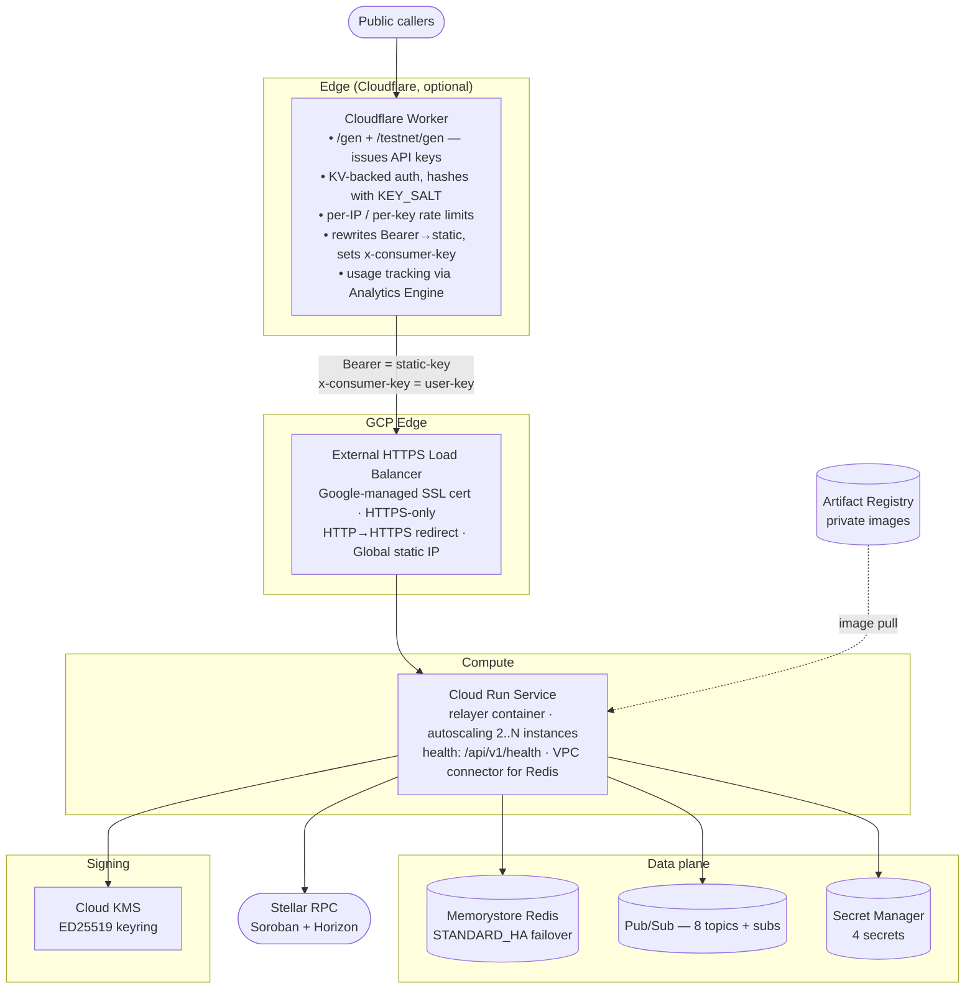
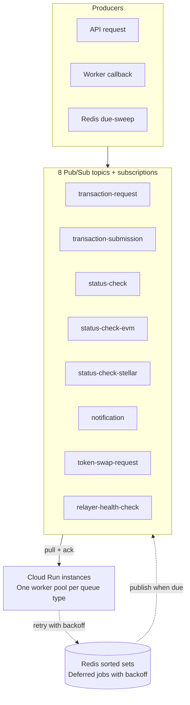

# Relayer Channels — GCP Deployment

Terraform module for deploying the Stellar Relayer Channels service on GCP. Runs on Cloud Run with Memorystore Redis, Pub/Sub for job processing, Cloud KMS for transaction signing, and optional Cloudflare Workers for API-key management.

For the AWS deployment, see the [root README](../../README.md).

## Architecture



| Component | GCP Service | Purpose |
| --- | --- | --- |
| Edge gateway | Cloudflare Worker + KV (optional) | API-key issuance, rate limiting, usage tracking |
| Load balancer | External HTTPS LB + Google-managed cert | TLS termination, health-checked routing |
| Compute | Cloud Run v2 | Runs the relayer container with autoscaling |
| State | Memorystore Redis 7.2 | Transaction records, sequence counters, distributed locks |
| Queue | 8 Pub/Sub topics + subscriptions | Distributed transaction processing |
| Secrets | Secret Manager | API keys, admin secrets, encryption keys |
| Signing | Cloud KMS (EC_SIGN_ED25519) | Transaction signing for fund + channel accounts |
| Image registry | Artifact Registry | Container image source |
| Networking | VPC + VPC Connector + Private Service Access | Private connectivity to Memorystore |

### How Pub/Sub queues work

Eight topics with pull subscriptions handle the transaction pipeline. Pub/Sub has no native delayed delivery, so deferred jobs (retries with backoff) sit in Redis sorted sets until due, then get published to the topic. The topic only ever carries ready-to-process jobs — no dead-letter topics needed.



### Resource sizing

Module defaults work for getting started. Bump them as traffic grows.

| Resource | Module default (prod) | Current GCP deployment |
| --- | --- | --- |
| CPU | 1 vCPU | 4 vCPU |
| Memory | 2 Gi | 8 Gi |
| Min instances | 2 | 3 |
| Max instances | 10 | 20 |
| Redis tier | STANDARD_HA | STANDARD_HA |
| Redis memory | 5 GB | 5 GB |

The module auto-adjusts sizing by environment (`prod` vs everything else):

| Setting | prod | other |
|---------|------|-------|
| Min instances | 2 | 1 |
| Max instances | 10 | 4 |
| CPU always allocated | yes | no |
| Redis tier | STANDARD_HA | BASIC |
| Redis memory | 5 GB | 1 GB |
| LB deletion protection | on | off |
| Log retention | 30 days | 7 days |

---

## Prerequisites

- **GCP project** with billing enabled
- **Service account** for Terraform with these roles: `editor`, `resourcemanager.projectIamAdmin`, `compute.networkAdmin`, `cloudkms.admin`, `pubsub.admin`, `secretmanager.admin`, `run.admin`, `artifactregistry.admin`
- **Domain** with DNS access (Route53, Cloud DNS, or other)
- **Terraform** >= 1.5.0, **gcloud CLI**, **Docker**
- (Optional) **Cloudflare account** for the `/gen` API-key flow
- **Soroban RPC access** — at least two private providers recommended for mainnet. The public image ships with the default public RPC; you override it after deployment (see step 5).
- **XLM** to fund the relayer's Stellar account and bootstrap channel accounts

### Repos you'll reference

| Repo | What it is |
| --- | --- |
| `OpenZeppelin/relayer-channels-infra` | This repo — Terraform modules + operator CLIs |
| `OpenZeppelin/openzeppelin-relayer` | The relayer application |
| `OpenZeppelin/relayer-plugin-channels` | Channels plugin (TypeScript) |

---

## Deployment

### 1. Authenticate

```bash
export GOOGLE_APPLICATION_CREDENTIALS="$HOME/path/to/service-account-key.json"
```

If your org blocks `gcloud auth application-default login`, create a service account key in IAM & Admin > Service Accounts > Keys.

### 2. Get the module

Reference it directly from GitHub:

```hcl
module "relayer_channels" {
  source = "git::https://github.com/OpenZeppelin/relayer-channels-infra.git//modules/gcp?ref=main"
  # ...
}
```

Or clone and use the examples:

```bash
git clone https://github.com/OpenZeppelin/relayer-channels-infra.git
cd relayer-channels-infra/examples/gcp       # stg
cd relayer-channels-infra/examples/gcp-prod   # prod
```

### 3. Configure

```bash
cp terraform.tfvars.example terraform.tfvars
```

Minimum config:

```hcl
project_id      = "my-gcp-project"
region          = "us-east1"
environment     = "prod"
network         = "default"
subnetwork      = "default"
domain_name     = "channels.your-company.com"
stellar_network = "mainnet"
queue_backend   = "pubsub"

# Public image via Artifact Registry remote repo — see step 4
container_image = "us-east1-docker.pkg.dev/my-project/ecr-public/w5h5k2p1/openzeppelin-relayer-channels:mainnet-latest"
```

Generate secrets (don't commit these):

```bash
export TF_VAR_relayer_api_key="$(uuidgen | tr '[:upper:]' '[:lower:]')"
export TF_VAR_channels_admin_secret="$(openssl rand -base64 32)"
export TF_VAR_storage_encryption_key="$(openssl rand -base64 32)"   # must be base64, not hex
```

Set up remote state in `versions.tf`:

```hcl
backend "gcs" {
  bucket = "your-terraform-state-bucket"
  prefix = "relayer-channels/prod.tfstate"
}
```

### 4. Container image

The public image is on ECR Public. Cloud Run can't pull from ECR directly, so set up an Artifact Registry remote repo to proxy it:

1. GCP Console > **Artifact Registry** > **Create Repository**
2. Format: **Docker**, Mode: **Remote**, Source: **Custom**, URL: `https://public.ecr.aws`
3. Name it `ecr-public`, pick your region

Then reference it:

```hcl
container_image = "us-east1-docker.pkg.dev/my-project/ecr-public/w5h5k2p1/openzeppelin-relayer-channels:mainnet-latest"
```

Tag scheme: `mainnet-<version>` (pinned, use in prod), `mainnet-latest` (moves), `testnet-<version>`, `testnet-latest`.

> The public image ships with `mainnet.sorobanrpc.com` as the default RPC. You must override this after deployment — see step 5.

### 5. Deploy

```bash
terraform init
terraform plan
terraform apply
```

Takes ~10–15 min. Memorystore creation is the slowest part.

### 6. DNS and SSL

The Google-managed cert needs DNS pointing at the LB IP before it provisions.

**Without Cloudflare:**
1. Create an A record: `channels.your-company.com` → `<load_balancer_ip>` (from terraform output)
2. Wait 15–60 min for cert to go ACTIVE

**With Cloudflare:**
1. Create Cloudflare A record → LB IP (proxy OFF, grey cloud)
2. Create Route53 A record → LB IP
3. Wait for cert to go ACTIVE
4. Change Route53 to CNAME → `channels.your-company.com.cdn.cloudflare.net`
5. Turn Cloudflare proxy ON (orange cloud)

> If the cert stays `FAILED_NOT_VISIBLE` for 30+ min, bump the cert name suffix in `load-balancer.tf` (e.g. `-cert-v2` → `-cert-v3`) and re-apply. `create_before_destroy` swaps it without downtime.

### 7. Override RPC endpoints

The public image uses the free public Soroban RPC, which rate-limits under load. After the service is healthy, override it with your private providers. This is a **one-time call** — the config persists in Redis.

```bash
curl -s \
  -H "Authorization: Bearer <your-relayer-api-key>" \
  -H "Content-Type: application/json" \
  -X PATCH https://channels.your-company.com/api/v1/networks/stellar:mainnet \
  -d '{
    "rpc_urls": [
      { "url": "https://your-primary-rpc.com/key", "weight": 100 },
      { "url": "https://your-secondary-rpc.com/key", "weight": 100 }
    ]
  }'
```

Verify:

```bash
curl -s -H "Authorization: Bearer <your-relayer-api-key>" \
  "https://channels.your-company.com/api/v1/networks?per_page=200" \
  | jq '.data[] | select(.id=="stellar:mainnet") | .rpc_urls'
```

Use at least two independent providers. The relayer load-balances by weight and rotates on failure.

> You only need to re-run this after a `RESET_STORAGE_ON_START=true` restart (which wipes Redis). Normal restarts preserve it.

### 8. Create the signer

```bash
ENV=mainnet API_KEY="$TF_VAR_relayer_api_key" \
GCP_SA_KEY_FILE="$HOME/path/to/sa-key.json" \
./scripts/gcp-kms-signer.sh
```

Then create the fund relayer via the relayer API:

```bash
curl -s -X POST https://channels.your-company.com/api/v1/relayers \
  -H "Authorization: Bearer $TF_VAR_relayer_api_key" \
  -H "Content-Type: application/json" \
  -d '{
    "id": "channels-fund",
    "name": "channels-fund",
    "network": "mainnet",
    "signer_id": "<signer-id-from-above>",
    "network_type": "stellar",
    "paused": false,
    "policies": { "min_balance": 0, "fee_payment_strategy": "relayer" }
  }'
```

### 9. Bootstrap channels

Install the CLI from `cli/` in this repo:

```bash
cd cli && bun install && bun run build
cd packages/oz-channels && bun link
cd ../oz-relayer && bun link
```

Set up a profile and bootstrap:

```bash
oz-channels profile init prod-mainnet

oz-channels bootstrap --to 200 --dry-run -p prod-mainnet   # preview
oz-channels bootstrap --to 200 -p prod-mainnet             # provision
```

### 10. Verify

```bash
curl https://channels.your-company.com/api/v1/health
oz-channels health -p prod-mainnet
oz-channels smoke run -p prod-mainnet
```

---

## Environments

Run stg and prod as separate Terraform workspaces with isolated state:

| Env | Network | Working directory | Pub/Sub prefix | VPC connector CIDR |
| --- | --- | --- | --- | --- |
| `stg` | testnet | `examples/gcp/` | `relayer-testnet-stg-` | `10.8.0.0/28` |
| `prod` | mainnet | `examples/gcp-prod/` | `relayer-mainnet-prod-` | `10.9.0.0/28` |

Use different CIDRs if both environments share a VPC. Resource names auto-suffix with `-<environment>` except for `prod`.

---

## Cloudflare (optional)

When enabled, a Cloudflare Worker handles API-key issuance (`/gen`), per-key rate limiting, and proxies requests to the LB with static-key injection.

```hcl
enable_cloudflare      = true
cloudflare_api_token   = "your-token"
cloudflare_zone_id     = "your-zone-id"                    # Dashboard > domain > Overview
cloudflare_account_id  = "your-account-id"                 # Dashboard URL bar
relayer_static_api_key = "same-as-your-relayer_api_key"
key_salt               = "<openssl rand -base64 32>"
cf_analytics_api_token = "your-token"                      # same token if it has Analytics Read
```

`relayer_static_api_key` should match your `relayer_api_key` — the Worker swaps every user's Bearer token for this key upstream. `key_salt` is used to hash user keys before storing in KV; generate it with `openssl rand -base64 32`.

### Without Cloudflare

If you don't use Cloudflare, the `/gen` endpoint is not available — there's no self-service API-key generation. Instead, callers authenticate directly with the `relayer_api_key` you configured during deployment. You manage access by sharing or rotating that key manually.

This works fine for controlled environments where you know your callers. If you need per-user keys, rate limiting, or usage tracking without Cloudflare, you'd need to build that into your own API gateway or proxy layer in front of the load balancer.

---

## Operations

### Deploys

Update `container_image` in tfvars and `terraform apply`. Cloud Run creates a new revision and shifts traffic automatically.

### Rollbacks

Set `container_image` back to the previous tag and apply.

### Scaling

```hcl
cpu                = "4"
memory             = "8Gi"
min_instance_count = 3
max_instance_count = 20
```

Apply — no downtime. Cloud Run's max is 1000 concurrent requests per instance. If you hit 502s under load, check the `concurrency` setting (`gcloud run services describe ...`).

### Channel pool

```bash
oz-channels bootstrap --from 201 --to 400 -p prod-mainnet   # grow the pool
oz-channels channels list -p prod-mainnet
oz-channels channels add channel-0050 -p prod-mainnet
oz-channels channels remove channel-0050 -p prod-mainnet
```

### Transactions

```bash
oz-relayer tx show <tx-id> -r channels-fund -p prod-mainnet --json
oz-relayer tx list -r channels-fund --status pending -p prod-mainnet
oz-relayer relayer balance channels-fund -p prod-mainnet
```

---

## Observability

### Logs

Cloud Run streams structured JSON logs to Cloud Logging.

```bash
# Errors in the last hour
gcloud logging read 'resource.type="cloud_run_revision" AND resource.labels.service_name="relayer-channels-service" AND severity>=ERROR' \
  --project=your-project --limit=20 --freshness=1h --format='value(textPayload)'

# Filter by tx ID
gcloud logging read 'resource.type="cloud_run_revision" AND textPayload:"<tx-id>"' \
  --project=your-project --limit=20 --freshness=1h

# Live tail
gcloud logging tail 'resource.type="cloud_run_revision" AND resource.labels.service_name="relayer-channels-service"' \
  --project=your-project
```

### Metrics to watch

**Cloud Run** (Console > Cloud Run > Service > Metrics):

| Metric | Signal |
| --- | --- |
| `container/cpu/utilization` | >80% sustained → scale up |
| `container/memory/utilization` | >70% → risk of OOM |
| `request_count` by status | 5xx spikes |
| `request_latencies` | p95/p99 degradation |
| `container/instance_count` | autoscaling behavior |

**Pub/Sub** (Console > Pub/Sub > Subscription > Metrics):

| Metric | Signal |
| --- | --- |
| `num_undelivered_messages` | growing backlog → falling behind |
| `oldest_unacked_message_age` | >60s → workers stuck |

**Memorystore** (Console > Memorystore > Instance):

| Metric | Signal |
| --- | --- |
| CPU utilization | >75% sustained |
| Memory usage ratio | >70% |
| Connected clients | near limit |

### Alerting

Set up alert policies in Cloud Monitoring > Alerting. Key ones:

- Cloud Run CPU >80% for 10 min
- Cloud Run memory >70% for 10 min
- Pub/Sub backlog >5000 for 10 min
- Pub/Sub oldest message >300s for 5 min
- Log-based metric for `POOL_CAPACITY` errors

### Prometheus

The relayer exposes metrics at `:8081/debug/metrics/scrape`. Scrape with Google Cloud Managed Prometheus or your own Prometheus instance.

---

## Debugging

| You have | Do this |
| --- | --- |
| Transaction ID | `oz-relayer tx show <tx-id> -r channels-fund --json -p <env>` |
| Error message | Search Cloud Logging: `textPayload:"<error>"` |
| "What's broken right now" | `gcloud logging read ... AND severity>=ERROR` |
| Stellar tx hash | Check Horizon, then find the relayer tx record |

Common log patterns:

| Pattern | Means |
| --- | --- |
| `provider paused` | RPC failover kicked in |
| `POOL_CAPACITY` | Channel pool exhausted — bootstrap more |
| `LOCKED_CONFLICT` | Two workers grabbed the same channel |
| `TRY_AGAIN_LATER` | Horizon throttling |

### Redis inspection

SSH into a VM in the same VPC:

```bash
redis-cli -h <redis_host> -p 6379
KEYS *tx:*
GET "oz-relayer:relayer:channels-fund:tx:<tx-id>"
```

---

## Security

**Secrets** are in Secret Manager, passed as env vars to Cloud Run.

**Network isolation:**
- Cloud Run: `INGRESS_TRAFFIC_INTERNAL_LOAD_BALANCER` in prod
- Egress: VPC Connector (`PRIVATE_RANGES_ONLY`) for Redis; direct for Stellar RPC and KMS
- Memorystore: Private Service Access only, no public IP
- Pub/Sub: IAM-scoped per topic/subscription

**IAM** — the Cloud Run SA (`{app_name}-run`) gets:

| Role | Scope |
| --- | --- |
| `secretmanager.secretAccessor` | per-secret |
| `monitoring.metricWriter` | project |
| `logging.logWriter` | project |
| `monitoring.viewer` | project |
| `cloudkms.signerVerifier` | per-key |
| `cloudkms.publicKeyViewer` | per-key |
| `pubsub.publisher` | per-topic |
| `pubsub.subscriber` | per-subscription |
| `artifactregistry.reader` | per-repo |

**KMS:** `EC_SIGN_ED25519`, SOFTWARE protection. Rotation = new key → new signer → new on-chain account → drain old → retire.

---

## Post-restart checklist

If you ever restart with `RESET_STORAGE_ON_START=true` (which wipes Redis), you need to redo the following — the service will be up but non-functional until these are done:

1. **Re-create the signer** — `./scripts/gcp-kms-signer.sh` (step 8)
2. **Re-create the fund relayer** — via the relayer API or your fund-relayer script, using the new signer ID
3. **Re-run the RPC override** — the PATCH to `/api/v1/networks/stellar:mainnet` with your private providers (step 7)
4. **Re-bootstrap channels** — `oz-channels bootstrap --to <N> -p <env>` (step 9)
5. **Fund the fund relayer** — if the on-chain account was recreated, send XLM to the new address

Normal restarts and redeployments (without `RESET_STORAGE_ON_START=true`) preserve everything in Redis — none of the above is needed.

---

## Gotchas

**Channel pool exhaustion** — `min_pool = ceil(TPS × settlement_time × 1.5)`. At 23 TPS with 5s settlement: ~173 channels. Fix: `oz-channels bootstrap --from <next> --to <new-total>`.

**SSL cert provisioning** — Google needs DNS → LB IP before it issues the cert. With Cloudflare, turn proxy off first, wait for ACTIVE, then proxy back on.

**VPC connector CIDR** — each environment in the same VPC needs a different `/28` range.

**Pub/Sub topic prefix** — must match what the image expects. Double-dash errors (`relayer-mainnet-prod--`) mean the prefix has a trailing dash the image doesn't expect. Adjust `PUBSUB_TOPIC_PREFIX` via `container_environment` if needed.

**Encryption key format** — `storage_encryption_key` must be base64-encoded 32 bytes (`openssl rand -base64 32`). Hex keys fail silently.

**Fee tuning** — `MAX_FEE` defaults to 1M stroops (0.1 XLM). Raise to 10M during network congestion. The plugin uses static fees — no automatic bumping.

**Container concurrency** — Cloud Run defaults to 80 concurrent requests per instance. If you see 502s under load, bump it: `gcloud run services update ... --concurrency=1000`.

---

## Variables

### Required

| Name | Type | Description |
|------|------|-------------|
| `project_id` | `string` | GCP project ID |
| `region` | `string` | GCP region |
| `environment` | `string` | `prod`, `stg`, etc. (1–16 chars) |
| `network` | `string` | VPC network name or self_link |
| `subnetwork` | `string` | Subnet name or self_link |
| `domain_name` | `string` | FQDN for the service |
| `container_image` | `string` | Container image URI |
| `relayer_api_key` | `string` | Relayer API key (sensitive) |
| `channels_admin_secret` | `string` | Admin secret (sensitive) |

### Optional

| Name | Type | Default | Description |
|------|------|---------|-------------|
| `app_name` | `string` | `"relayer-channels"` | Resource name prefix |
| `connector_ip_cidr_range` | `string` | `"10.8.0.0/28"` | VPC connector CIDR (/28) |
| `container_port` | `number` | `8080` | Listen port |
| `cpu` | `string` | `"1"` | CPU (`"1"`, `"2"`, `"4"`, `"8"`) |
| `memory` | `string` | `"2Gi"` | Memory |
| `min_instance_count` | `number` | `null` | Auto: 2 prod, 1 other |
| `max_instance_count` | `number` | `null` | Auto: 10 prod, 4 other |
| `stellar_network` | `string` | `"testnet"` | `mainnet` or `testnet` |
| `queue_backend` | `string` | `"pubsub"` | `pubsub` (recommended) or `redis` |
| `log_level` | `string` | `"warn"` | App log level |
| `webhook_signing_key` | `string` | `""` | Set only if using webhooks |
| `storage_encryption_key` | `string` | `""` | Base64-encoded 32 bytes. Recommended for prod. |
| `redis_tier` | `string` | `null` | `BASIC` or `STANDARD_HA` (auto per env) |
| `redis_memory_size_gb` | `number` | `null` | Auto: 5 prod, 1 other |
| `enable_cloudflare` | `bool` | `false` | Enable Workers gateway |
| `lb_deletion_protection` | `bool` | `null` | Auto: true prod |
| `container_environment` | `list(object)` | `[]` | Extra env vars (user wins on conflicts) |
| `labels` | `map(string)` | `{}` | Labels for all resources |

See `variables.tf` for the full list including Cloudflare, Cloud Functions, and networking options.

## Outputs

| Name | Description |
|------|-------------|
| `cloud_run_service_name` / `cloud_run_service_uri` | Service name and URL |
| `load_balancer_ip` | Static IP for DNS |
| `redis_host` / `redis_port` | Memorystore connection |
| `pubsub_topics` / `pubsub_subscriptions` | Queue resource names |
| `kms_signing_key_id` | Full KMS key ID |
| `artifact_registry_url` | Docker push target |
| `secret_ids` | Secret Manager IDs |
| `cloudflare_worker_name` | Worker name (null if disabled) |

---

## Known issues

**Redis TLS disabled** — the relayer binary doesn't support TLS for Redis connections. Memorystore is only reachable via Private Service Access (VPC peering), so traffic stays within Google's network.

**Secrets as plain env vars** — secrets are passed as Cloud Run env vars rather than Secret Manager `secret_key_ref` references. This is a workaround for a deployment issue. Plan to switch to proper secret references.
