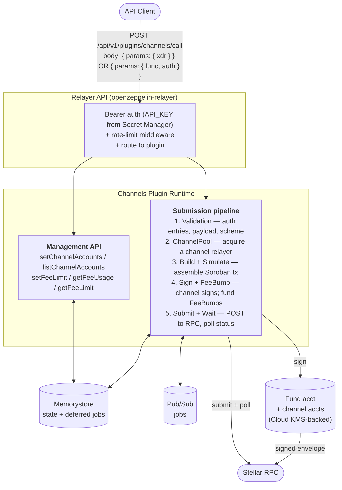
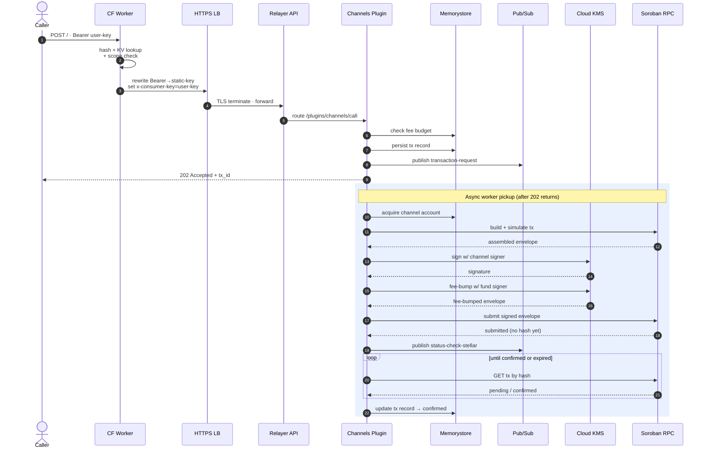
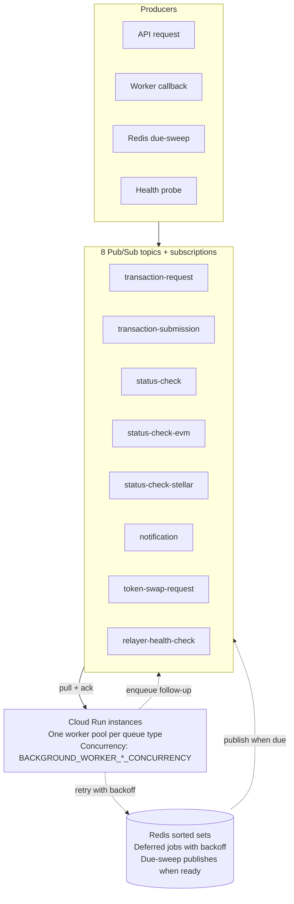

# Hosted Stellar Relayer — GCP Operator Deployment Guide

> A step-by-step guide for infrastructure teams deploying a hosted Stellar relayer service on Google Cloud Platform.
>
> **Audience:** infrastructure operators who have run production GCP workloads but are new to OpenZeppelin's relayer stack.
> **Outcome:** a hosted Stellar Channels service in your own GCP project capable of serving the same workload profile OpenZeppelin currently runs (~2M+ transactions/day across ~2500 relayers).

---

## 1. Overview

OpenZeppelin currently runs a hosted Stellar relayer service at `channels.openzeppelin.com` (mainnet) and `channels.openzeppelin.com/testnet` (testnet). The service absorbs the operational complexity of parallel Stellar transaction submission — channel-account pool management, fee bumping, sequence-number arbitration, multi-RPC failover — and exposes a simple HTTP API to downstream callers.

This guide is for infrastructure teams deploying the hosted relayer service on GCP.

### What you will end up with

After following this guide, you will have:

- A production-ready hosted Stellar Channels service running in your own GCP project, exposed at a domain you control (e.g., `channels.your-company.com`).
- A **Cloud Run** compute tier with autoscaling, fronted by an **External HTTPS Load Balancer** with a Google-managed SSL certificate.
- **Memorystore Redis** (in production: STANDARD_HA with automatic failover) for state and deferred-job scheduling.
- **Eight Pub/Sub topics + subscriptions** handling the distributed transaction-processing pipeline (when `queue_backend = "pubsub"`).
- Optional **Cloudflare Worker** fronting the LB for self-serve API-key issuance (the `/gen` flow), per-user rate limiting, and usage analytics.
- **Secret Manager** entries for every secret. Secrets are injected as environment variables at container startup.
- **Cloud KMS** for ED25519 transaction signing — the module provisions a keyring and asymmetric signing key.
- **Artifact Registry** — a private Docker repository for storing relayer container images with baked-in RPC configurations.
- Optional **Cloud Functions** for fund-relayer balance monitoring.

The system handles two transaction-submission modes:

- **Signed XDR mode** — the caller signs a complete Stellar transaction envelope and submits it; the service only handles fee-bumping and submission.
- **Soroban `func` + `auth` mode** — the caller submits a Soroban host function and authorization entries; the service assembles, simulates, signs with a channel account, fee-bumps, and submits.

### What this guide assumes you already have

- Strong GCP infrastructure background (VPC, Cloud Run, IAM, Cloud DNS, Memorystore, Pub/Sub).
- Terraform fluency (≥ 1.5.0).
- A target GCP project where you can create the full resource set.
- A domain you control (managed via Route53, Cloud DNS, or another DNS provider).
- (Optional) A Cloudflare account if you want the `/gen` API-key gateway.

---

## 2. Architecture

### Cloud architecture


**Module:** the entire stack above is provisioned by the `gcp` Terraform module in `OpenZeppelin/relayer-channels-infra`. Operators consume it either by cloning the repo or referencing it as an external module from their own Terraform.

### Components

| Component | GCP Service | Purpose |
| --- | --- | --- |
| Edge gateway | Cloudflare Worker + KV (optional) | API-key issuance, rate limiting, usage tracking |
| Load balancer | External HTTPS LB + Google-managed cert | TLS termination, HTTPS-only, health-checked routing |
| Compute | Cloud Run v2 Service | Runs the relayer container with autoscaling |
| State | Memorystore Redis 7.2 | Transaction records, sequence counters, distributed locks |
| Queue | 8 Pub/Sub topics + 8 subscriptions | Distributed transaction processing pipeline |
| Secrets | Secret Manager | API keys, admin secrets, encryption keys |
| Signing | Cloud KMS (EC_SIGN_ED25519) | Transaction signing for fund + channel accounts |
| Image registry | Artifact Registry (private) | Container image source |
| Observability | Cloud Logging + Cloud Monitoring | Application logs, metrics |
| Networking | VPC + VPC Connector + Private Service Access | Private connectivity to Memorystore |
| Optional monitors | Cloud Functions + Cloud Scheduler | Balance-check function |

### App architecture (Channels Plugin runtime)



### Transaction lifecycle



### Pub/Sub queue topology

The relayer's distributed processing layer uses eight Pub/Sub topics with pull subscriptions. The Pub/Sub backend handles retries via Redis sorted sets (store-and-run-when-due pattern) — no dead-letter topics are needed.



**Deferred job pattern:** Pub/Sub has no native delayed delivery, so deferred jobs (retries with backoff) are stored in Redis sorted sets keyed by their due time. A due-sweep worker runs every 1–5 seconds per queue type, claims due jobs from Redis, and publishes them to the topic. The topic only ever carries already-due jobs.

### Capacity profile

The reference deployment OpenZeppelin runs handles a **growing ~3M transactions per day** sustained, served by **~1,000 relayers** (fund + channel-account entities combined). The module defaults are sized conservatively for new deployments; expect to grow into something closer to the production shape as your workload scales.

**GCP resource sizing reference:**

The table below shows the module defaults and the current GCP deployment values (bumped to handle concurrent transaction load).

| Resource | Module default (prod) | Current GCP deployment |
| --- | --- | --- |
| CPU | 1 vCPU | **4 vCPU** |
| Memory | 2 Gi | **8 Gi** |
| Min instances | 2 | **3** |
| Max instances | 10 | **20** |
| Redis tier | STANDARD_HA | STANDARD_HA |
| Redis memory | 5 GB | 5 GB |

The module defaults are operationally fine for a new deployment ramping up. The GCP deployment was bumped from defaults to handle concurrent transaction stress testing. Tune further as your workload scales.

---

## 3. Prerequisites

### Accounts and access

- **GCP project** with billing enabled and permissions to create: Cloud Run services, Memorystore instances, Pub/Sub topics/subscriptions, Secret Manager secrets, Cloud KMS keyrings/keys, Compute Engine load balancers, VPC connectors, Artifact Registry repositories, IAM role bindings.
- **Service Account** for Terraform with the following roles:
  - `roles/editor` — general resource creation
  - `roles/resourcemanager.projectIamAdmin` — grant IAM roles to service accounts
  - `roles/compute.networkAdmin` — VPC peering for Private Service Access
  - `roles/cloudkms.admin` — create KMS keyrings and keys
  - `roles/pubsub.admin` — create topics/subscriptions and set IAM policies
  - `roles/secretmanager.admin` — create secrets and set IAM policies
  - `roles/run.admin` — manage Cloud Run services
  - `roles/artifactregistry.admin` — create repositories and set IAM policies
- **Domain** you control, with access to create DNS records (Route53, Cloud DNS, or another provider).
- **(Optional) Cloudflare account** with a zone matching your domain for the `/gen` API-key gateway.

### Tooling

| Tool | Version | Why |
| --- | --- | --- |
| Terraform | ≥ 1.5.0 | Module language constraints |
| Google provider | ≥ 5.0, < 7.0 | Pinned in `versions.tf` |
| Cloudflare provider | ~> 5.0 | Required even when `enable_cloudflare = false` (Terraform constraint) |
| Docker | recent stable | For building the container image |
| gcloud CLI | recent stable | For auth, Artifact Registry, debugging |
| Node.js ≥ 18 + pnpm ≥ 10 | recent stable | If modifying the Channels plugin |

### Stellar-side prerequisites

- **Soroban RPC access** - At least two independent private providers for mainnet (recommended). Public Image has public RPC URL baked into the container image at build time.
- **Initial XLM funding** — fund the fund relayer's Stellar account, then bootstrap channel accounts from that balance using `oz-channels bootstrap`.

### Reference repositories

| Repo | Role | Visibility |
| --- | --- | --- |
| `OpenZeppelin/relayer-channels-infra` | Terraform modules + operator CLIs (`oz-relayer`, `oz-channels`) | Public |
| `OpenZeppelin/openzeppelin-relayer` | The relayer application | Public |
| `OpenZeppelin/relayer-plugin-channels` | The Channels plugin runtime (TypeScript) | Public |

---

## 4. Environments

We recommend operators maintain separate environments with isolated state:

| Environment | Stellar network | GCP project pattern | Cloud Run service | Pub/Sub prefix |
| --- | --- | --- | --- | --- |
| `prod` | Stellar Mainnet | Production project | `relayer-channels-service` | `relayer-mainnet-prod-` |
| `stg` | Stellar Testnet | Same or separate project | `relayer-channels-stg-service` | `relayer-testnet-stg-` |

The service naming is auto-derived by the module from `app_name` + `environment`. When `environment = "prod"`, the resource-name suffix is dropped; for other environments, names are suffixed with `-<environment>`.

Each environment gets its own:
- Terraform state (use separate GCS backend prefixes)
- Terraform working directory (`examples/gcp/` for stg, `examples/gcp-prod/` for prod)
- VPC connector CIDR range (e.g., `10.8.0.0/28` for stg, `10.9.0.0/28` for prod if sharing a VPC)
- Secret Manager secrets, KMS keys, Pub/Sub topics
- Cloudflare Worker (if enabled — uses distinct names like `relayer-channels-stg-gcp-gateway`)

---

## 5. Step-by-step deployment

### Step 5.1 — Set up authentication

```bash
export GOOGLE_APPLICATION_CREDENTIALS="$HOME/path/to/service-account-key.json"
```

If your GCP org blocks `gcloud auth application-default login`, use a service account key file instead (IAM & Admin > Service Accounts > Keys > Create new key > JSON).

### Step 5.2 — Get the module

**Option A — Reference as external module (recommended):**

```hcl
module "relayer_channels" {
  source = "git::https://github.com/OpenZeppelin/relayer-channels-infra.git//modules/gcp?ref=main"
  # ... variables
}
```

**Option B — Clone the repo:**

```bash
git clone https://github.com/OpenZeppelin/relayer-channels-infra.git
cd relayer-channels-infra/examples/gcp  # or examples/gcp-prod
```

### Step 5.3 — Configure Terraform backend

In `versions.tf`, configure remote state (do not store state on a laptop in production):

```hcl
terraform {
  backend "gcs" {
    bucket = "your-org-terraform-state"
    prefix = "relayer-channels/prod.tfstate"
  }
}
```

Initialize:

```bash
terraform init
```

### Step 5.4 — Create your tfvars

```bash
cp terraform.tfvars.example terraform.tfvars
```

Minimum required configuration:

```hcl
project_id      = "my-gcp-project"
region          = "us-east1"
environment     = "prod"                # or "stg"
network         = "default"
subnetwork      = "default"
domain_name     = "channels.your-company.com"
# Use the public image via an Artifact Registry remote repo (see Step 5.5)
# After deployment, override the public RPC URLs with your private providers (see Step 5.8)
container_image = "us-east1-docker.pkg.dev/my-project/ecr-public/w5h5k2p1/openzeppelin-relayer-channels:mainnet-latest"

stellar_network = "mainnet"             # or "testnet"
queue_backend   = "pubsub"

# Secrets — never commit these
relayer_api_key        = ""  # set via TF_VAR_relayer_api_key
channels_admin_secret  = ""  # set via TF_VAR_channels_admin_secret
storage_encryption_key = ""  # set via TF_VAR_storage_encryption_key
```

Generate secrets:

```bash
export TF_VAR_relayer_api_key="$(uuidgen | tr '[:upper:]' '[:lower:]')"
export TF_VAR_channels_admin_secret="$(openssl rand -base64 32)"
export TF_VAR_webhook_signing_key="$(openssl rand -hex 32)"
export TF_VAR_storage_encryption_key="$(openssl rand -base64 32)"   # must be base64-encoded 32 bytes
```

### Step 5.5 — Container image

OpenZeppelin publishes pre-built container images to ECR Public. These can be consumed via an **Artifact Registry remote repository** that proxies ECR Public — Cloud Run pulls from Artifact Registry natively.

**Setting up an Artifact Registry remote repo (one-time):**

1. Go to GCP Console > **Artifact Registry** > **Create Repository**
2. Format: **Docker**, Mode: **Remote**, Remote source: **Custom**, URL: `https://public.ecr.aws`
3. Name: e.g. `ecr-public`, Region: your region

Then reference the image in your tfvars:

```hcl
container_image = "us-east1-docker.pkg.dev/my-project/ecr-public/w5h5k2p1/openzeppelin-relayer-channels:mainnet-latest"
```

**Tag scheme:**

| Tag pattern | Points at |
| --- | --- |
| `mainnet-<version>` (e.g. `mainnet-1.4.2`) | Stellar mainnet build, pinned. **Use this in production.** |
| `mainnet-latest` | Most recent mainnet build. Convenient for dev; will move under you. |
| `testnet-<version>` / `testnet-latest` | Stellar testnet equivalents. |

> **Note:** The public image ships with the default public Soroban RPC endpoint (`mainnet.sorobanrpc.com`). For production, you **must** override the RPC URLs with your own private providers after deployment — see **Step 5.8**.

### Step 5.6 — Plan and apply

```bash
terraform plan -out plan.tfplan
terraform apply plan.tfplan
```

Initial apply takes ~10–15 minutes (Memorystore provisioning is the slowest leg; Private Service Access peering and SSL cert provisioning also take a few minutes).

**Key outputs:**

| Output | Used for |
| --- | --- |
| `cloud_run_service_name` | Service management, `gcloud run` commands |
| `cloud_run_service_uri` | Direct Cloud Run access (bypasses LB) |
| `load_balancer_ip` | DNS record creation |
| `redis_host` | Manual Redis inspection (via VM in the VPC) |
| `pubsub_topics` | Map of queue names → Pub/Sub topic names |
| `kms_signing_key_id` | Full KMS key ID for signer creation |
| `artifact_registry_url` | Docker push target for container images |

### Step 5.7 — Set up DNS and SSL

The Google-managed SSL certificate requires DNS to point to the load balancer IP before it can provision.

**Without Cloudflare:**
1. Create an A record: `channels.your-company.com` → `<load_balancer_ip>`
2. Wait 15–60 minutes for the certificate to provision (check status in GCP Console > Network Services > Load Balancing > certificate tab)

**With Cloudflare:**
1. Create a Cloudflare A record: `channels.your-company.com` → `<load_balancer_ip>` (proxy OFF initially, grey cloud)
2. Create a Route53 A record: `channels.your-company.com` → `<load_balancer_ip>`
3. Wait for Google-managed cert to become ACTIVE
4. Switch Route53 to CNAME: `channels.your-company.com` → `channels.your-company.com.cdn.cloudflare.net`
5. Turn Cloudflare proxy ON (orange cloud)

### Step 5.8 — Configure private Stellar RPC endpoints

The public container image ships with the default public Soroban RPC endpoint (`https://mainnet.sorobanrpc.com`). For production workloads, the public RPC will rate-limit your requests, causing transaction failures under load.

After the service is up and healthy, override the RPC URLs with your own private providers (e.g., QuickNode, Alchemy, Ankr). This is a **one-time operation** — the updated config is persisted in Redis and survives container restarts.

```bash
curl -s \
  -H "Authorization: Bearer <your-relayer-api-key>" \
  -H "Content-Type: application/json" \
  -X PATCH https://channels.your-company.com/api/v1/networks/stellar:mainnet \
  -d '{
    "rpc_urls": [
      { "url": "https://your-primary-rpc-provider.com/your-api-key", "weight": 100 },
      { "url": "https://your-secondary-rpc-provider.com/your-api-key", "weight": 100 }
    ]
  }'
```

Verify the update:

```bash
curl -s \
  -H "Authorization: Bearer <your-relayer-api-key>" \
  "https://channels.your-company.com/api/v1/networks?per_page=200" \
  | jq '.data[] | select(.id=="stellar:mainnet") | .rpc_urls'
```

> **Note:** You only need to re-run this if you perform a `RESET_STORAGE_ON_START=true` restart, which wipes all Redis data including the network config. Normal restarts and redeployments preserve the config.

We recommend at least two independent RPC providers for mainnet for redundancy. The relayer load-balances across the listed URLs by weight and rotates on failures.

### Step 5.9 — Create the fund-relayer signer

Create a GCP Cloud KMS signer using the provided script:

```bash
ENV=mainnet API_KEY="$TF_VAR_relayer_api_key" \
GCP_SA_KEY_FILE="$HOME/path/to/sa-key.json" \
./scripts/gcp-kms-signer.sh
```

This calls the relayer API with `"type": "google_cloud_kms"` and creates a signer backed by the Cloud KMS key provisioned by Terraform.

Then create the fund relayer:

```bash
ENV=mainnet API_KEY="$TF_VAR_relayer_api_key" \
SIGNER_ID="<signer-id-from-above>" \
./scripts/fund-relayer.sh
```

### Step 5.10 — Bootstrap the channel-account pool

Install the `oz-channels` CLI from the `cli/` directory in this repo:

```bash
# From the root of relayer-channels-infra
cd cli
bun install
bun run build

# Link the CLIs globally
cd packages/oz-channels && bun link
cd ../oz-relayer && bun link

# Verify
oz-channels --help
oz-relayer --help
```

> Requires [Bun](https://bun.sh) runtime (Node.js 22+ compatible).

Create a profile and bootstrap:

```bash
oz-channels profile init prod-mainnet
# Prompts for: URL, API key, plugin ID (channels), admin secret, network

# Preview
oz-channels bootstrap --to 200 --dry-run -p prod-mainnet

# Provision
oz-channels bootstrap --to 200 -p prod-mainnet
```

### Step 5.11 — Verify end-to-end

```bash
# Health check
curl -sS https://channels.your-company.com/api/v1/health

# Generate an API key (if Cloudflare enabled)
curl -X POST https://channels.your-company.com/gen

# Smoke test
oz-channels smoke run -p prod-mainnet
```

---

## 6. Configuration reference

### Module-managed container environment variables

These are set by the Terraform module and should not be overridden unless you have a specific reason:

| Env var | Set to | Source |
| --- | --- | --- |
| `HOST` | `0.0.0.0` | Module |
| `STELLAR_NETWORK` | `var.stellar_network` | Module |
| `FUND_RELAYER_ID` | `var.fund_relayer_id` | Module |
| `API_KEY_HEADER` | `x-consumer-key` | Module — keyed to Cloudflare Worker rewriting |
| `REPOSITORY_STORAGE_TYPE` | `redis` | Module |
| `RESET_STORAGE_ON_START` | `false` | Module |
| `METRICS_ENABLED` | `true` | Module |
| `METRICS_PORT` | `8081` | Module |
| `LOG_FORMAT` | `json` | Module |
| `LOG_LEVEL` | `var.log_level` | Module |
| `REDIS_URL` | `redis://<memorystore-host>:<port>` | Module — derived from Memorystore |
| `REDIS_READER_URL` | `redis://<read-endpoint>:<port>` | Module — falls back to primary if BASIC tier |
| `GCP_PROJECT_ID` | `var.project_id` | Module |
| `GCP_REGION` | `var.region` | Module |
| `DISTRIBUTED_MODE` | `var.distributed_mode` | Module |
| `QUEUE_BACKEND` | `var.queue_backend` (when distributed) | Module |
| `PUBSUB_TOPIC_PREFIX` | Auto-derived: `relayer-{network}-{environment}` | Module |
| `PUBSUB_PROJECT_ID` | `var.project_id` | Module |

### Module-managed secrets (from Secret Manager)

| Container env var | Secret Manager ID | Required? | Notes |
| --- | --- | --- | --- |
| `API_KEY` | `{app_name}-relayer-api-key` | Yes | Authenticates all API requests to the relayer |
| `PLUGIN_ADMIN_SECRET` | `{app_name}-channels-admin-secret` | Yes | Required for channel management operations |
| `WEBHOOK_SIGNING_KEY` | `{app_name}-webhook-signing-key` | Optional | Only created when `webhook_signing_key` is set in tfvars. Required if you use webhook notifications; omit if not using webhooks. |
| `STORAGE_ENCRYPTION_KEY` | `{app_name}-storage-encryption-key` | Optional | Only created when `storage_encryption_key` is set in tfvars. Encrypts sensitive data at rest in Redis. **Strongly recommended for production.** Must be base64-encoded 32 bytes (`openssl rand -base64 32`). |

The `lifecycle { ignore_changes = [secret_data] }` on secret versions means: once created, Terraform will not overwrite the value if you rotate it via `gcloud` or the Console.

**Rotation procedure:**

```bash
# Update secret
echo -n "new-value" | gcloud secrets versions add \
  relayer-channels-relayer-api-key --data-file=- \
  --project=your-project

# Force Cloud Run to pick up the new value
gcloud run services update relayer-channels-service \
  --region=us-east1 --project=your-project \
  --update-labels="redeploy=$(date +%s)"
```

### Production reference values

For operators targeting OZ's reference scale (~2M+ tx/day), these are the env-var values to tune:

```hcl
container_environment = [
  # Worker concurrency
  { name = "BACKGROUND_WORKER_TRANSACTION_REQUEST_CONCURRENCY",                 value = "200" },
  { name = "BACKGROUND_WORKER_TRANSACTION_SENDER_CONCURRENCY",                  value = "200" },
  { name = "BACKGROUND_WORKER_TRANSACTION_STATUS_CHECKER_STELLAR_CONCURRENCY",  value = "300" },
  { name = "BACKGROUND_WORKER_TRANSACTION_STATUS_CHECKER_CONCURRENCY",          value = "1" },
  { name = "BACKGROUND_WORKER_TRANSACTION_STATUS_CHECKER_EVM_CONCURRENCY",      value = "1" },
  { name = "BACKGROUND_WORKER_NOTIFICATION_SENDER_CONCURRENCY",                 value = "1" },
  { name = "BACKGROUND_WORKER_SOLANA_TOKEN_SWAP_REQUEST_CONCURRENCY",           value = "1" },
  { name = "BACKGROUND_WORKER_RELAYER_HEALTH_CHECK_CONCURRENCY",                value = "1" },

  # API + plugin concurrency
  { name = "RELAYER_CONCURRENCY_LIMIT",        value = "800" },
  { name = "PLUGIN_MAX_CONCURRENCY",           value = "8000" },
  { name = "MAX_CONNECTIONS",                   value = "4000" },

  # Timeouts
  { name = "REQUEST_TIMEOUT_SECONDS",           value = "60" },
  { name = "PLUGIN_POOL_REQUEST_TIMEOUT_SECS",  value = "60" },
  { name = "PLUGIN_GLOBAL_TIMEOUT_MS",          value = "55000" },
  { name = "PLUGIN_POLLING_TIMEOUT_MS",         value = "45000" },

  # Rate limits
  { name = "RATE_LIMIT_REQUESTS_PER_SECOND",    value = "400" },

  # Redis pools
  { name = "REDIS_POOL_MAX_SIZE",               value = "3000" },
  { name = "REDIS_READER_POOL_MAX_SIZE",        value = "3000" },

  # Transaction cleanup
  { name = "TRANSACTION_EXPIRATION_HOURS",      value = "0.1" },

  # Contract-level pool isolation
  { name = "LIMITED_CONTRACTS",                 value = "C<contract1>,C<contract2>" },
  { name = "CONTRACT_CAPACITY_RATIO",           value = "0.6" },
]
```

### Environment-based defaults

The module automatically adjusts resource sizing based on `environment == "prod"`:

| Setting | Production | Non-Production |
|---------|-----------|----------------|
| Min Cloud Run instances | 2 | 1 |
| Max Cloud Run instances | 10 | 4 |
| CPU always allocated | Yes | No |
| Redis tier | STANDARD_HA (failover) | BASIC |
| Redis memory | 5 GB | 1 GB |
| LB deletion protection | Enabled | Disabled |
| Log retention | 30 days | 7 days |

---

## 7. Operational playbook

### 7.1 — Deploys

**Routine deploy** (new container image):

1. Build and push the new image via the GitHub Actions workflow (or manually push to Artifact Registry).
2. Update `container_image` in tfvars to the new tag.
3. `terraform apply` — Cloud Run creates a new revision and routes traffic to it.

### 7.2 — Rollbacks

Update `container_image` to the previous tag and `terraform apply`. Cloud Run keeps previous revisions available for instant rollback.

### 7.3 — Scaling

Adjust in tfvars:

```hcl
cpu                = "4"
memory             = "8Gi"
min_instance_count = 3
max_instance_count = 20
```

`terraform apply` applies the change without interruption.

### 7.4 — Channel-pool management

```bash
# Add slots 201..400
oz-channels bootstrap --from 201 --to 400 -p prod-mainnet

# List current channels
oz-channels channels list -p prod-mainnet

# Add/remove individual channels
oz-channels channels add channel-0050 -p prod-mainnet
oz-channels channels remove channel-0050 -p prod-mainnet
```

### 7.5 — Monitoring Pub/Sub

Check queue health in **GCP Console > Pub/Sub > Subscriptions > Metrics tab**:

| Metric | Watch for |
| --- | --- |
| `num_undelivered_messages` | Growing backlog = processing falling behind |
| `oldest_unacked_message_age` | > 60s sustained = workers may be stuck |
| Pull/Ack operations | Healthy = messages consumed as fast as they arrive |

### 7.6 — Monitoring Redis

Check in **GCP Console > Memorystore > Instance > Monitoring tab**:

| Metric | Watch for |
| --- | --- |
| CPU utilization | Spikes above 75% sustained |
| Memory usage | Climb past 70% |
| Connected clients | Near connection limit |

### 7.7 — Inspecting transactions

```bash
oz-relayer tx show <tx-id> -r channels-fund -p prod-mainnet --json
oz-relayer tx list -r channels-fund --status pending -p prod-mainnet
oz-relayer relayer balance channels-fund -p prod-mainnet
```

### 7.8 — Observability

The relayer emits structured JSON logs and Prometheus-format metrics. On GCP, these map to Cloud Logging and Cloud Monitoring.

#### Cloud Logging

Cloud Run automatically streams `stdout`/`stderr` to Cloud Logging. The relayer's `LOG_FORMAT=json` produces structured entries with fields like `level`, `target`, `span.tx_id`, `span.relayer_id`, and `span.request_id`.

**Viewing logs:**

```bash
# Recent errors
gcloud logging read 'resource.type="cloud_run_revision" AND resource.labels.service_name="relayer-channels-service" AND severity>=ERROR' \
  --project=your-project --limit=20 --freshness=1h --format='value(textPayload)'

# Filter by transaction ID
gcloud logging read 'resource.type="cloud_run_revision" AND textPayload:"<tx-id>"' \
  --project=your-project --limit=20 --freshness=1h

# Live tail (similar to CloudWatch Live Tail)
gcloud logging tail 'resource.type="cloud_run_revision" AND resource.labels.service_name="relayer-channels-service"' \
  --project=your-project
```

**GCP Console:** Cloud Logging > Logs Explorer > filter by `resource.type="cloud_run_revision"` and `resource.labels.service_name="<your-service>"`.

#### Cloud Monitoring — Built-in Metrics

Cloud Run and Pub/Sub automatically emit metrics to Cloud Monitoring (no agent required):

**Cloud Run metrics** (GCP Console > Cloud Run > Service > Metrics tab):

| Metric | What it tells you |
| --- | --- |
| `run.googleapis.com/container/cpu/utilization` | CPU usage per instance — sustained >80% means scale up |
| `run.googleapis.com/container/memory/utilization` | Memory usage — sustained >70% risks OOM |
| `run.googleapis.com/request_count` | Request throughput by response code — watch for 5xx spikes |
| `run.googleapis.com/request_latencies` | p50/p95/p99 latency — watch for degradation |
| `run.googleapis.com/container/instance_count` | Active instances — confirms autoscaling behavior |
| `run.googleapis.com/container/startup_latencies` | Cold-start time — high values affect first-request latency |

**Pub/Sub metrics** (GCP Console > Pub/Sub > Subscription > Metrics tab):

| Metric | What it tells you |
| --- | --- |
| `pubsub.googleapis.com/subscription/num_undelivered_messages` | Queue depth — growing backlog means processing is falling behind |
| `pubsub.googleapis.com/subscription/oldest_unacked_message_age` | How long the oldest message has been waiting — >60s sustained means workers may be stuck |
| `pubsub.googleapis.com/subscription/pull_message_operation_count` | Pull throughput — confirms workers are active |
| `pubsub.googleapis.com/subscription/ack_message_operation_count` | Ack throughput — confirms messages are being processed |

**Memorystore metrics** (GCP Console > Memorystore > Instance > Monitoring tab):

| Metric | What it tells you |
| --- | --- |
| `redis.googleapis.com/stats/cpu_utilization` | Redis CPU — spikes above 75% sustained need attention |
| `redis.googleapis.com/stats/memory/usage_ratio` | Memory usage — climb past 70% means capacity planning needed |
| `redis.googleapis.com/stats/connected_clients` | Connection count — watch for approaching limits |
| `redis.googleapis.com/stats/commands_processed` | Command throughput — correlates with transaction volume |

#### Log-based Metrics

Create custom metrics from log patterns to track application-specific signals. In **Cloud Logging > Log-based Metrics > Create Metric**:

| Metric name | Filter | Purpose |
| --- | --- | --- |
| `relayer/errors` | `resource.type="cloud_run_revision" AND severity>=ERROR` | Total error rate |
| `relayer/pool_capacity` | `textPayload:"POOL_CAPACITY"` | Channel pool exhaustion events |
| `relayer/provider_paused` | `textPayload:"provider paused"` | RPC failover events |
| `relayer/tx_confirmed` | `textPayload:"confirmed"` | Transaction confirmation rate |

Or via gcloud:

```bash
gcloud logging metrics create relayer-errors \
  --project=your-project \
  --description="Relayer error count" \
  --log-filter='resource.type="cloud_run_revision" AND resource.labels.service_name="relayer-channels-service" AND severity>=ERROR'
```

#### Alerting

Create alert policies in **Cloud Monitoring > Alerting > Create Policy**:

| Alert | Metric | Condition | Severity |
| --- | --- | --- | --- |
| High error rate | `relayer/errors` (log-based) | > 50 errors in 5 min | Critical |
| Cloud Run high CPU | `container/cpu/utilization` | > 80% for 10 min | Warning |
| Cloud Run high memory | `container/memory/utilization` | > 70% for 10 min | Warning |
| Pub/Sub backlog growing | `subscription/num_undelivered_messages` | > 5000 for 10 min | Warning |
| Pub/Sub old messages | `subscription/oldest_unacked_message_age` | > 300s for 5 min | Critical |
| Pool exhaustion | `relayer/pool_capacity` (log-based) | > 0 in 5 min | Critical |

Configure notification channels (email, Slack, PagerDuty) in **Cloud Monitoring > Alerting > Notification Channels**.

#### Prometheus Metrics

The relayer exposes Prometheus-format metrics on port `8081` at `/debug/metrics/scrape` (enabled by `METRICS_ENABLED=true`). When `enable_prometheus = true`, the Cloud Run service account has `monitoring.metricWriter` permissions for Google Cloud Managed Prometheus.

To scrape these metrics, you can:
- Use **Google Cloud Managed Prometheus** with a sidecar collector
- Use a self-hosted Prometheus instance that scrapes the Cloud Run service
- Use the built-in Cloud Run metrics (above) for most operational needs

---

## 8. Debugging guide

### Entry points

| You have | Start with |
| --- | --- |
| Transaction ID | `oz-relayer tx show <tx-id> -r channels-fund --json -p <env>` |
| Error message | Search Cloud Logging for the error pattern |
| Time window | `gcloud logging read` with `--freshness` |
| Stellar tx hash | Query Horizon, work backwards to the relayer's tx record |
| "What's failing now" | Filter logs by `severity>=ERROR` |

### Common log patterns

| Pattern | Indicates |
| --- | --- |
| `provider paused` | RPC failover triggered |
| `sequence`, `counter` | Sequence-number drift or contention |
| `POOL_CAPACITY` | Channel-account pool exhausted |
| `LOCKED_CONFLICT` | Two workers tried to acquire the same channel |
| `TRY_AGAIN_LATER` | Horizon-side throttling |

### Redis inspection

Connect from a VM in the same VPC:

```bash
redis-cli -h <redis_host> -p <redis_port>
KEYS *tx:*
GET "oz-relayer:relayer:channels-fund:tx:<tx-id>"
```

---

## 9. Security model

### 9.1 — Secrets handling

All secrets are stored in **Secret Manager**. Currently passed as plain environment variables to Cloud Run (see Known Issues for the plan to switch to `secret_key_ref` references).

### 9.2 — Network isolation

- **Cloud Run ingress:** restricted to internal + load balancer traffic (`INGRESS_TRAFFIC_INTERNAL_LOAD_BALANCER` in production; `INGRESS_TRAFFIC_ALL` for testing).
- **Cloud Run egress:** VPC Connector with `PRIVATE_RANGES_ONLY` — private traffic goes through the VPC (to Memorystore), public traffic (Stellar RPC, KMS API) goes direct.
- **Memorystore:** accessible only via Private Service Access (VPC peering). No public IP.
- **Pub/Sub:** IAM-scoped — only the Cloud Run service account has publisher/subscriber access to the relayer's topics.

### 9.3 — IAM least-privilege

The Cloud Run service account (`{app_name}-run`) has:

| Role | Scope | Purpose |
| --- | --- | --- |
| `secretmanager.secretAccessor` | Per-secret | Read secrets at startup |
| `monitoring.metricWriter` | Project | Write custom metrics |
| `logging.logWriter` | Project | Write application logs |
| `monitoring.viewer` | Project | Read Pub/Sub backlog depth |
| `cloudkms.signerVerifier` | Per-key | Sign transactions |
| `cloudkms.publicKeyViewer` | Per-key | Read public key |
| `pubsub.publisher` | Per-topic | Publish job messages |
| `pubsub.subscriber` | Per-subscription | Pull and ack messages |
| `artifactregistry.reader` | Per-repository | Pull container images |

### 9.4 — TLS posture

- **Load Balancer:** Google-managed SSL certificate, HTTPS on 443, HTTP redirects to HTTPS.
- **Memorystore:** transit encryption disabled (Private Service Access provides network-level isolation). Enable if your compliance requirements mandate it and the relayer binary supports TLS (see Known Issues).
- **Cloudflare → LB:** set Cloudflare zone SSL mode to "Full" for end-to-end TLS.

### 9.5 — Cloud KMS for Stellar signers

- **Key algorithm:** `EC_SIGN_ED25519` (the Stellar-compatible ED25519 curve)
- **Protection level:** `SOFTWARE` (HSM also supported but adds latency)
- **IAM:** Cloud Run SA has `signerVerifier` + `publicKeyViewer` on the key
- **Rotation:** provision a new key, register a new signer/relayer, fund the new on-chain account, drain the old, retire

---

## 10. Key gotchas

### 10.1 — Channel-account exhaustion (`POOL_CAPACITY`)

**Sizing formula:**
```
min_pool = ceil(target_TPS × avg_settlement_seconds × safety_factor)
```

At ~23 TPS sustained with ~5s Stellar settlement and 1.5× safety: `23 × 5 × 1.5 = 173` channels minimum.

**Recovery:** `oz-channels bootstrap --from <existing+1> --to <new-total>`

### 10.2 — SSL certificate provisioning

Google-managed certificates require DNS to point to the LB IP before they provision. With Cloudflare enabled, you must temporarily point DNS directly to the LB IP (bypass Cloudflare proxy), wait for cert to become ACTIVE, then switch to the Cloudflare CNAME.

> **Note:** If the cert is stuck in `FAILED_NOT_VISIBLE` for more than 30 minutes, it likely needs to be recreated. Bump the cert name suffix in `load-balancer.tf` (e.g., `-cert-v2` → `-cert-v3`) and re-apply. The `create_before_destroy` lifecycle ensures the new cert is provisioned before the old one is removed, avoiding downtime.

### 10.3 — VPC connector CIDR overlap

If running multiple environments (stg + prod) in the same VPC, each needs a unique `connector_ip_cidr_range` (e.g., `10.8.0.0/28` for stg, `10.9.0.0/28` for prod).

### 10.4 — Private Service Access (shared connection)

The VPC can only have one Private Service Access connection to `servicenetworking.googleapis.com`. If stg creates it first, prod's apply will fail unless `update_on_creation_fail = true` is set on the `google_service_networking_connection` resource (the module handles this).

### 10.5 — Pub/Sub topic prefix and image compatibility

The `PUBSUB_TOPIC_PREFIX` env var must match what the container image expects. Different image versions may or may not append a trailing dash to the prefix. If you see "topic does not exist" errors with double dashes (`relayer-mainnet-prod--`), remove the trailing dash from the prefix. If topics are missing entirely (no dash), add it back.

### 10.6 — STORAGE_ENCRYPTION_KEY format

The encryption key **must be base64-encoded 32 bytes** (44 characters with `=` padding). Generate with `openssl rand -base64 32`. Hex-encoded keys will silently fail with "Invalid key length: expected 32 bytes, got 0".

### 10.7 — Fee-bump tuning under congestion

Set via the `MAX_FEE` env var (default `1000000` stroops = 0.1 XLM). Under network congestion, raise to `10000000` (1 XLM). The Channels plugin uses static fees — it does not dynamically bump on `INSUFFICIENT_FEE`.

---

## 11. Terraform variables reference

### Required

| Name | Type | Description |
|------|------|-------------|
| `project_id` | `string` | GCP project ID |
| `region` | `string` | GCP region (e.g. `us-east1`) |
| `environment` | `string` | Deployment environment (`prod`, `stg`). 1-16 chars. |
| `network` | `string` | VPC network name or self_link |
| `subnetwork` | `string` | Subnet name or self_link |
| `domain_name` | `string` | FQDN for the service |
| `container_image` | `string` | Container image URI |
| `relayer_api_key` | `string` | Relayer API key (sensitive) |
| `channels_admin_secret` | `string` | Admin secret (sensitive) |

### Optional — Core

| Name | Type | Default | Description |
|------|------|---------|-------------|
| `app_name` | `string` | `"relayer-channels"` | Resource name prefix |
| `name_suffix_environment` | `bool` | `true` | Append `-{env}` to names (auto-off for prod) |
| `labels` | `map(string)` | `{}` | Labels for all resources |

### Optional — Networking

| Name | Type | Default | Description |
|------|------|---------|-------------|
| `connector_machine_type` | `string` | `"e2-micro"` | VPC connector machine type |
| `connector_min_instances` | `number` | `2` | Min connector instances |
| `connector_max_instances` | `number` | `3` | Max connector instances |
| `connector_ip_cidr_range` | `string` | `"10.8.0.0/28"` | CIDR for VPC connector (/28, must not overlap) |

### Optional — Container / Cloud Run

| Name | Type | Default | Description |
|------|------|---------|-------------|
| `container_port` | `number` | `8080` | Container port |
| `cpu` | `string` | `"1"` | CPU allocation (`"1"`, `"2"`, `"4"`) |
| `memory` | `string` | `"2Gi"` | Memory allocation |
| `min_instance_count` | `number` | `null` | Min instances. Auto: 2 (prod), 1 (non-prod) |
| `max_instance_count` | `number` | `null` | Max instances. Auto: 10 (prod), 4 (non-prod) |
| `cpu_always_allocated` | `bool` | `null` | Always allocate CPU. Auto: true (prod) |
| `health_check_path` | `string` | `"/api/v1/health"` | Probe path |
| `container_environment` | `list(object)` | `[]` | Additional env vars (user overrides win) |

### Optional — Application

| Name | Type | Default | Description |
|------|------|---------|-------------|
| `stellar_network` | `string` | `"testnet"` | `mainnet` or `testnet` |
| `fund_relayer_id` | `string` | `"channels-fund"` | Fund relayer ID |
| `distributed_mode` | `bool` | `true` | Enable distributed queue processing |
| `queue_backend` | `string` | `"pubsub"` | `pubsub` (recommended) or `redis` |
| `log_level` | `string` | `"warn"` | Application log level |

### Optional — Secrets

| Name | Type | Default | Description |
|------|------|---------|-------------|
| `webhook_signing_key` | `string` | `""` | Webhook signing key (sensitive). Only set if using webhook notifications; omit otherwise. |
| `storage_encryption_key` | `string` | `""` | Encrypts data at rest in Redis. Must be base64-encoded 32 bytes (sensitive). Strongly recommended for production. |

### Optional — Redis

| Name | Type | Default | Description |
|------|------|---------|-------------|
| `redis_tier` | `string` | `null` | `BASIC` or `STANDARD_HA`. Auto per environment. |
| `redis_memory_size_gb` | `number` | `null` | Memory in GB. Auto: 5 (prod), 1 (non-prod). |
| `redis_version` | `string` | `"REDIS_7_2"` | Redis version |

### Optional — Cloudflare

| Name | Type | Default | Description |
|------|------|---------|-------------|
| `enable_cloudflare` | `bool` | `false` | Enable Cloudflare Workers gateway |
| `cloudflare_zone_id` | `string` | `""` | Required when Cloudflare enabled |
| `cloudflare_account_id` | `string` | `""` | Required when Cloudflare enabled |
| `relayer_static_api_key` | `string` | `""` | Static API key injected by the Worker upstream (sensitive). See below for how to generate. |
| `key_salt` | `string` | `""` | Salt for hashing user API keys before storing in KV (sensitive). See below for how to generate. |
| `gen_ip_rate_hour` | `number` | `2` | Max `/gen` per IP per hour |
| `relay_rpm_per_key` | `number` | `60` | Max relay RPM per key |

**Generating `relayer_static_api_key` and `key_salt`:**

The `relayer_static_api_key` is the API key the Cloudflare Worker uses to authenticate with the relayer upstream. It should match the `relayer_api_key` you set for the deployment — the Worker replaces every user's Bearer token with this key before forwarding to the relayer.

```bash
# relayer_static_api_key — use the same value as relayer_api_key
relayer_static_api_key = "<your relayer_api_key value>"

# key_salt — a random secret used to hash user API keys before storing in Cloudflare KV.
# Generate with:
#   openssl rand -base64 32
key_salt = "<output of openssl rand -base64 32>"
```

**Example:**

```hcl
enable_cloudflare      = true
cloudflare_api_token   = "your-cloudflare-api-token"    # Cloudflare API token with Workers + DNS permissions
cloudflare_zone_id     = "your-zone-id"                 # From Cloudflare dashboard > your domain > Overview
cloudflare_account_id  = "your-account-id"              # From Cloudflare dashboard > account home (URL bar)
relayer_static_api_key = "97638d32-5699-41b5-a501-ce2ec8339fdd"   # same as relayer_api_key
key_salt               = "wiXOPbO5JgJ3rLn7txnDIiA6s1EmwkRmkStq1UqoWtw="  # openssl rand -base64 32
cf_analytics_api_token = "your-cloudflare-api-token"    # same token works if it has Analytics Read permission
```

### Optional — Load Balancer

| Name | Type | Default | Description |
|------|------|---------|-------------|
| `lb_deletion_protection` | `bool` | `null` | Auto: true (prod), false (non-prod) |
| `lb_log_sample_rate` | `number` | `0` | Request log sampling (0 = disabled) |

## Outputs

| Name | Description |
|------|-------------|
| `cloud_run_service_name` | Cloud Run service name |
| `cloud_run_service_uri` | Cloud Run service URI (internal) |
| `cloud_run_service_account_email` | Cloud Run service account email |
| `load_balancer_ip` | Global static IP of the HTTPS LB |
| `domain_name` | Service domain name |
| `redis_host` / `redis_port` / `redis_read_endpoint` | Memorystore connection info |
| `pubsub_topics` / `pubsub_subscriptions` | Map of queue names → Pub/Sub resource names |
| `secret_ids` | Map of secret names → Secret Manager IDs |
| `kms_key_ring_name` / `kms_signing_key_name` / `kms_signing_key_id` | Cloud KMS key info |
| `artifact_registry_repository` / `artifact_registry_url` | Artifact Registry info |
| `cloudflare_worker_name` | Worker name (null if disabled) |

---

## 12. Known issues

### Memorystore Redis TLS

Transit encryption is disabled because the relayer binary is not compiled with TLS support for Redis connections. This is acceptable because Memorystore is only accessible via Private Service Access (VPC peering) — traffic never leaves Google's network.

### Secret Manager references

Secrets are currently passed as plain environment variables to Cloud Run instead of using `secret_key_ref` Secret Manager references. This is a workaround for a 0-byte issue encountered during initial deployment. Plan to switch back to Secret Manager references for better security posture.
