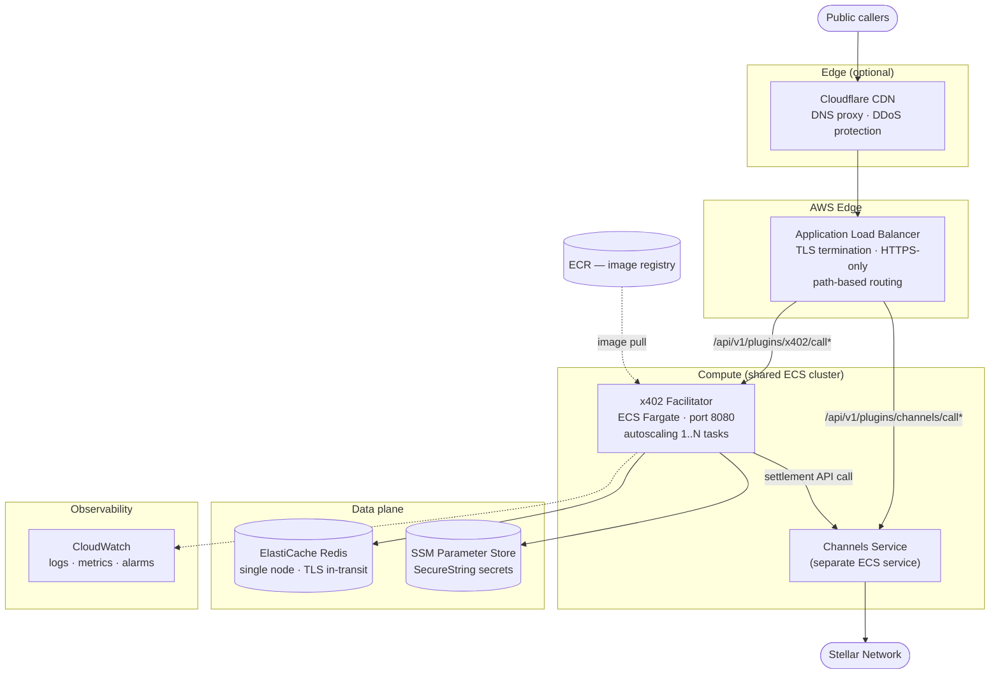
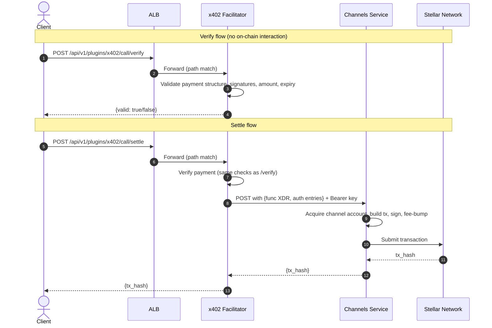

# x402 Payment Facilitator on AWS

How to deploy an [x402](https://www.x402.org/) payment facilitator on AWS. The facilitator verifies and settles x402 payments on the Stellar network, delegating all on-chain transaction submission to a running Channels service.

---

## 1. Overview

The x402 facilitator is built on [openzeppelin-relayer](https://github.com/OpenZeppelin/openzeppelin-relayer) with the `relayer-plugin-x402-facilitator` plugin. It exposes three HTTP endpoints (`/verify`, `/settle`, `/supported`) that implement the [XC-Payments specification](https://www.x402.org/) for Stellar.

### What you'll end up with

When you're done, you'll have:

- An ECS Fargate service running the x402 facilitator, fronted by an ALB with TLS
- ElastiCache Redis for state storage (transaction records, plugin state)
- SSM Parameter Store SecureString entries for every secret -- nothing in env vars or baked into images
- CloudWatch Logs, Metrics, and Alarms (production) with SNS alerting
- An ECR repository for your container images
- Path-based ALB routing so the facilitator can run alongside a Channels service on the same load balancer
- Separate staging and production environments via Terraform workspaces

### How it works

The x402 facilitator doesn't submit transactions to Stellar directly. It verifies payment payloads and hands off settlement to the Channels service:

1. **Verify** -- validates payment structure, user-signed auth entries, amount, asset, and expiry. No on-chain interaction.
2. **Settle** -- verifies the payment, extracts the Soroban host function XDR and user-signed auth entries, then calls the Channels service API. Channels acquires a channel account, builds and signs the transaction, and submits it.
3. **Supported** -- returns discovery info (supported networks, accepted assets, signer address) per the XC-Payments spec.

### What this guide assumes

You should already have:

- A running Channels service deployment (see the [relayer-channels module](../relayer-channels/) for AWS or the [GCP module](../gcp/) for GCP)
- An existing ECS cluster and ALB from that Channels deployment (x402 shares these)
- A domain in Route53 you control
- (Optional) A Cloudflare account for CDN and DNS proxying

---

## 2. Architecture

### Cloud architecture



The main design choices worth calling out:

| Decision | Rationale |
| --- | --- |
| Shared ECS cluster with Channels | Simplifies operations and shares capacity. No separate cluster needed. |
| Shared ALB with path-based routing | `/api/v1/plugins/x402/call*` routes to x402; other paths route to Channels. No extra ALB cost. |
| No direct on-chain transactions | All settlement delegated to Channels, which manages channel accounts, sequence numbers, and fee bumping. |
| Minimal Redis | `cache.t4g.micro` single node is sufficient. x402 has low state requirements compared to Channels. |
| Separate testnet service (prod) | Production runs separate ECS services for mainnet and testnet with an NGINX sidecar for path rewriting. |

### Components at a glance

| Component | AWS resource | Purpose |
| --- | --- | --- |
| Compute | ECS Fargate Service | Runs the x402 container + CloudWatch metrics sidecar |
| State | ElastiCache Redis 7.1 | Plugin state and transaction records |
| Secrets | SSM Parameter Store SecureString | API keys, keystore JSON, encryption keys |
| Load balancer | ALB listener rule (shared with Channels) | Path-based routing to x402 target group |
| Image registry | ECR | Docker image storage |
| Monitoring | CloudWatch Alarms + SNS (prod only) | CPU, memory, and running-task-count alerting |
| Logs | CloudWatch Logs | Structured JSON application logs |

---

## 3. Environments

We use Terraform workspaces to manage three logical environments:

| Environment | Workspace | ECS cluster (shared) | Networks | Tasks | CPU/Mem (task) |
| --- | --- | --- | --- | --- | --- |
| Staging | `stg` | `<prefix>-stg-cluster` | `stellar:testnet` | 1-4 | 512 / 1024 |
| Prod mainnet | `prod` | `<prefix>-prod-mainnet-cluster` | `stellar:pubnet` | 2-4 | 4096 / 8192 |
| Prod testnet | `prod` | `<prefix>-prod-testnet-cluster` | `stellar:testnet` | 2-4 | 1024 / 2048 |

Production testnet runs as a separate ECS service with an NGINX sidecar that strips the `/testnet/` path prefix before proxying to the relayer.

---

## 4. Prerequisites

### 4.1 Accounts and tooling

| Requirement | Details |
| --- | --- |
| AWS account | With permissions to create ECS, ElastiCache, ALB, SSM, ECR, CloudWatch, SNS resources |
| Terraform | >= 1.1.3 |
| AWS CLI | v2, configured with appropriate credentials |
| Docker | For pulling and pushing container images |
| Existing Channels deployment | ECS cluster + ALB must already exist |
| Domain + ACM certificate | TLS certificate attached to the ALB HTTPS listener |
| (Optional) Cloudflare | For CDN proxying and DNS management |

### 4.2 Stellar setup

Each environment needs its own Stellar keypair. The x402 facilitator account is used for identity (its address shows up in `/supported` for client discovery) and signature verification (validating user-signed auth entries in `/verify`).

It's _not_ used for building transactions, providing sequence numbers, or paying fees -- Channels handles all of that.

Generate a keystore:

```bash
# From the openzeppelin-relayer repo
cargo run --example create_key -- \
  --password <YOUR_PASSPHRASE> \
  --output-dir ./keys \
  --filename local-signer.json
```

The keystore JSON file is ~500 bytes. Note the Stellar public address from the output.

Fund the account -- it needs to exist on-chain with enough XLM for base reserves and trustlines:
- Testnet: use [friendbot](https://friendbot.stellar.org) to fund with test XLM.
- Mainnet: transfer XLM from an existing funded account.

### 4.3 Channels API keys

The x402 facilitator calls Channels to settle payments, so you'll need API keys:

- Staging: 1 key (testnet)
- Production: 2 keys (one for mainnet, one for testnet)

Generate keys via the Channels service management endpoint. Worth noting: the default fee limit on a new key is probably too low for x402 settlement volume, so bump it after generation.

---

## 5. Step-by-step Deployment

### Step 1: Set up Terraform backend

Configure your S3 backend for state storage:

```hcl
terraform {
  backend "s3" {
    bucket         = "<your-terraform-state-bucket>"
    key            = "x402/terraform.tfstate"
    region         = "<your-region>"
    dynamodb_table = "<your-lock-table>"  # optional but recommended
  }
}
```

### Step 2: Configure providers

You'll need two AWS provider configurations: the default `aws` provider and an aliased `aws.dns` for Route53 records. This matches the Channels module pattern and supports the common case where Route53 lives in a separate AWS account.

```hcl
provider "aws" {
  region = "us-east-1"
}

provider "aws" {
  alias  = "dns"
  region = "us-east-1"
  # Use a different profile/role if Route53 is in a separate account
}

# Optional: only needed if using Cloudflare for DNS proxying
provider "cloudflare" {
  api_token = var.cloudflare_api_token
}
```

### Step 3: Generate secrets

Generate the secret values you'll pass as Terraform variables. The module creates SSM Parameter Store SecureString entries for you.

```bash
# Relayer management API key (random 32-char string)
openssl rand -hex 16

# Storage encryption key (32 bytes, base64-encoded — NOT hex)
openssl rand -base64 32

# Keystore JSON — generate from the openzeppelin-relayer repo
cargo run --example create_key -- \
  --password <YOUR_PASSPHRASE> \
  --output-dir ./keys \
  --filename local-signer.json

# Read the keystore contents (you will pass this as a variable)
cat keys/local-signer.json

# Channels API key — generate via the Channels service management endpoint
# Increase the default fee limit after generation for x402 settlement volume
```

Create a `terraform.tfvars` file (add it to `.gitignore`):

```hcl
relayer_api_key        = "<generated-api-key>"
keystore_json          = "<contents-of-local-signer.json>"
keystore_passphrase    = "<passphrase-used-during-generation>"
storage_encryption_key = "<base64-encoded-32-byte-key>"
channels_api_key       = "<channels-api-key>"
```

> **Important:** The `storage_encryption_key` must be base64-encoded, not hex. If you use hex, the relayer will fail to start with a cryptic error.

### Step 4: Call the module

Declare the sensitive input variables:

```hcl
variable "relayer_api_key"        { type = string; sensitive = true }
variable "keystore_json"          { type = string; sensitive = true }
variable "keystore_passphrase"    { type = string; sensitive = true }
variable "storage_encryption_key" { type = string; sensitive = true }
variable "channels_api_key"       { type = string; sensitive = true }
```

#### Example A: Shared ALB mode (running alongside Channels)

Use this when you already have a Channels deployment with an ALB and ECS cluster. The module adds a listener rule and target group to the existing ALB.

```hcl
module "x402" {
  source = "git::https://github.com/OpenZeppelin/relayer-channels-infra.git//modules/x402/aws?ref=main"

  providers = {
    aws     = aws
    aws.dns = aws.dns
  }

  # Core
  environment = "prod"

  # Networking
  vpc_id            = "vpc-xxxxx"
  vpc_cidr          = "10.0.0.0/16"
  public_subnet_ids = ["subnet-aaa", "subnet-bbb"]

  # Shared ALB (from existing Channels deployment)
  existing_alb_listener_arn      = "arn:aws:elasticloadbalancing:us-east-1:123456789:listener/app/channels-alb/abc/def"
  existing_alb_security_group_id = "sg-xxxxx"

  # Existing ECS cluster (from Channels)
  existing_ecs_cluster_arn = "arn:aws:ecs:us-east-1:123456789:cluster/relayer-channels-cluster"

  # Container
  container_image = "123456789.dkr.ecr.us-east-1.amazonaws.com/x402-facilitator:latest"

  # Secrets (the module writes these to SSM Parameter Store)
  relayer_api_key        = var.relayer_api_key
  keystore_json          = var.keystore_json
  keystore_passphrase    = var.keystore_passphrase
  storage_encryption_key = var.storage_encryption_key

  # Channels API key — inject via container_secrets with the correct env var name
  # for your network (CHANNELS_MAINNET_API_KEY, CHANNELS_TESTNET_API_KEY, etc.)
  container_secrets = [
    {
      name      = "CHANNELS_MAINNET_API_KEY"
      valueFrom = "arn:aws:ssm:us-east-1:123456789:parameter/x402/prod/channels-mainnet-api-key"
    }
  ]

  tags = { Project = "x402" }
}
```

#### Example B: Standalone mode (own ALB)

If you want an independent deployment, the module can create its own ALB, ACM certificate, and Route53 records.

```hcl
module "x402" {
  source = "git::https://github.com/OpenZeppelin/relayer-channels-infra.git//modules/x402/aws?ref=main"

  providers = {
    aws     = aws
    aws.dns = aws.dns
  }

  # Core
  environment = "stg"

  # Networking
  vpc_id            = "vpc-xxxxx"
  vpc_cidr          = "10.0.0.0/16"
  public_subnet_ids = ["subnet-aaa", "subnet-bbb"]

  # DNS (standalone mode — module creates ALB + ACM cert + Route53 record)
  domain_name     = "x402-stg.your-company.com"
  route53_zone_id = "Z1234567890"

  # Container
  container_image = "123456789.dkr.ecr.us-east-1.amazonaws.com/x402-facilitator:latest"

  # Secrets
  relayer_api_key        = var.relayer_api_key
  keystore_json          = var.keystore_json
  keystore_passphrase    = var.keystore_passphrase
  storage_encryption_key = var.storage_encryption_key

  # Channels API key
  container_secrets = [
    {
      name      = "CHANNELS_STG_API_KEY"
      valueFrom = "arn:aws:ssm:us-east-1:123456789:parameter/x402/stg/channels-stg-api-key"
    }
  ]
}
```

The module picks shared-ALB vs. standalone mode based on whether `existing_alb_listener_arn` is set. Leave it empty and the module creates a full ALB with TLS and DNS.

### Step 5: Container image

Pre-built x402 facilitator images are published to [OpenZeppelin's Docker Hub](https://hub.docker.com/u/openzeppelin). Pull the appropriate tag for your network and push it to your own ECR registry (or reference it directly if your ECS tasks can pull from Docker Hub).

Tag convention: `mainnet-<version>`, `testnet-<version>`, `mainnet-latest`, `testnet-latest`.

```bash
# Pull from Docker Hub and push to your ECR
docker pull openzeppelin/x402-facilitator:mainnet-latest
docker tag openzeppelin/x402-facilitator:mainnet-latest <your-account>.dkr.ecr.<region>.amazonaws.com/x402-facilitator:mainnet-latest

aws ecr get-login-password --region <region> | docker login --username AWS --password-stdin <your-account>.dkr.ecr.<region>.amazonaws.com
docker push <your-account>.dkr.ecr.<region>.amazonaws.com/x402-facilitator:mainnet-latest
```

### Step 6: Deploy

```bash
# Initialize (first time only)
terraform init

# Review the plan
terraform plan

# Apply
terraform apply
```

For separate staging and production environments, use either Terraform workspaces or separate root module directories.

### Step 7: Verify

Grab the outputs and make sure everything's running:

```bash
# Get the service endpoint
terraform output domain_name      # standalone mode
terraform output alb_dns_name     # standalone mode (raw ALB hostname)
terraform output ecs_service_name # ECS service name for aws ecs commands

# Check ECS service health
aws ecs describe-services \
  --cluster <cluster-name> \
  --services "$(terraform output -raw ecs_service_name)" \
  --query 'services[0].{status:status,running:runningCount,desired:desiredCount}'

# Test the health endpoint (401 means it's up — the relayer requires auth on all endpoints)
curl -s -o /dev/null -w "%{http_code}" https://<your-domain>/api/v1/plugins/x402/call
# Expected: 401

# Test the supported endpoint
curl -H "Authorization: Bearer <your-api-key>" \
  https://<your-domain>/api/v1/plugins/x402/call/supported
```

### Module outputs

| Output | Description |
| --- | --- |
| `ecs_cluster_name` | ECS cluster name (null when using an existing cluster) |
| `ecs_cluster_arn` | ECS cluster ARN (null when using an existing cluster) |
| `ecs_service_name` | ECS service name |
| `ecr_repository_url` | ECR repository URL (null when `container_image` was provided) |
| `alb_dns_name` | ALB DNS name (null when using shared ALB) |
| `domain_name` | Service domain name |
| `redis_primary_endpoint` | Redis primary endpoint address |
| `ssm_parameter_prefix` | SSM Parameter Store prefix for this deployment's secrets |
| `target_group_arn` | ALB target group ARN |
| `sns_topic_arn` | SNS alarm topic ARN (null when monitoring is disabled) |

See [`variables.tf`](./variables.tf) for every variable the module accepts, including optional settings for Redis node type, autoscaling limits, CloudWatch exporter sidecar, Cloudflare integration, and ALB access logs.

---

## 6. Configuration Reference

### Environment variables

| Variable | Prod value | Stg value | Description |
| --- | --- | --- | --- |
| `REDIS_URL` | `redis://<endpoint>:6379` | same | ElastiCache primary endpoint |
| `REPOSITORY_STORAGE_TYPE` | `redis` | `redis` | Storage backend |
| `RESET_STORAGE_ON_START` | `false` | `false` | Preserve state across restarts |
| `CONFIG_FILE_PATH` | `config/config.json` | same | Plugin and relayer config path |
| `HOST` | `0.0.0.0` | same | Bind address |
| `LOG_LEVEL` | `warn` | `info` | Application log level |
| `LOG_FORMAT` | `json` | `json` | Structured logging format |
| `METRICS_ENABLED` | `true` | `true` | Expose Prometheus metrics |
| `METRICS_PORT` | `8081` | `8081` | Metrics endpoint port |

### Rate limiting and concurrency

| Variable | Prod | Stg | Description |
| --- | --- | --- | --- |
| `RATE_LIMIT_REQUESTS_PER_SECOND` | `200` | `400` | Global request rate limit |
| `RATE_LIMIT_BURST` | `200` | `500` | Burst allowance above steady rate |
| `MAX_CONNECTIONS` | `1000` | `4000` | Max concurrent HTTP connections |
| `RELAYER_CONCURRENCY_LIMIT` | `400` | `800` | Max concurrent relayer operations |
| `PLUGIN_MAX_CONCURRENCY` | `1000` | `4000` | Max concurrent plugin invocations |
| `TRANSACTION_EXPIRATION_HOURS` | `0.1` | `0.1` | Transaction TTL (~6 minutes) |
| `REQUEST_TIMEOUT_SECONDS` | `60` | `60` | HTTP request timeout |
| `PLUGIN_POOL_REQUEST_TIMEOUT_SECS` | `60` | `60` | Plugin pool request timeout |

Production uses lower rate limits because it's handling real money. Staging is opened up for load testing.

### Secrets (SSM Parameter Store)

| Env var | SSM path | Description |
| --- | --- | --- |
| `API_KEY` | `/x402/{env}/api-key` | Relayer management API key |
| `KEYSTORE_JSON` | `/x402/{env}/keystore-json` | Stellar keystore file contents |
| `KEYSTORE_PASSPHRASE` | `/x402/{env}/keystore-passphrase` | Keystore passphrase |
| `STORAGE_ENCRYPTION_KEY` | `/x402/{env}/storage-encryption-key` | 32-byte base64 key for Redis encryption |
| `CHANNELS_STG_API_KEY` | `/x402/{env}/channels-stg-api-key` | Channels API key (staging) |
| `CHANNELS_MAINNET_API_KEY` | `/x402/{env}/channels-mainnet-api-key` | Channels API key (prod mainnet) |
| `CHANNELS_TESTNET_API_KEY` | `/x402/{env}/channels-testnet-api-key` | Channels API key (prod testnet) |

---

## 7. Operational Playbook

### 7.1 Rolling deployment

Pull the new image from Docker Hub, push it to your ECR, and roll the service:

```bash
# Pull new version and push to ECR
docker pull openzeppelin/x402-facilitator:mainnet-<version>
docker tag openzeppelin/x402-facilitator:mainnet-<version> <ecr-url>:<version>
docker push <ecr-url>:<version>

# Roll the ECS service
aws ecs update-service \
  --cluster <cluster-name> \
  --service x402-<workspace>-service \
  --force-new-deployment

# Wait for stability
aws ecs wait services-stable \
  --cluster <cluster-name> \
  --services x402-<workspace>-service
```

### 7.2 Scaling

Autoscaling targets 70% CPU utilization, scaling between the configured min and max task counts. If you need to override it:

```bash
aws ecs update-service \
  --cluster <cluster-name> \
  --service x402-<workspace>-service \
  --desired-count <count>
```

### 7.3 Viewing logs

```bash
# Stream live logs
aws logs tail /aws/ecs/x402-<workspace>/task --follow

# Search for errors
aws logs filter-log-events \
  --log-group-name /aws/ecs/x402-<workspace>/task \
  --filter-pattern "ERROR"
```

### 7.4 Exec into a running container

```bash
aws ecs execute-command \
  --cluster <cluster-name> \
  --task <task-id> \
  --container x402-<workspace> \
  --interactive \
  --command "/bin/sh"
```

### 7.5 Redis inspection

You can connect to Redis through an ECS exec session or a bastion host:

```bash
# From inside a container
redis-cli -h <redis-endpoint> -p 6379

# Useful commands
redis-cli INFO memory
redis-cli DBSIZE
redis-cli KEYS "x402:*"
```

### 7.6 Rotating secrets

Generate new values, update SSM, then force a deploy so the new tasks pick them up. ECS fetches secrets at task start, so existing tasks won't see the change until they're replaced.

```bash
aws ssm put-parameter \
  --name "/x402/<env>/<secret-name>" \
  --type "SecureString" \
  --value "<new-value>" \
  --overwrite

aws ecs update-service \
  --cluster <cluster-name> \
  --service x402-<workspace>-service \
  --force-new-deployment
```

---

## 8. Security Model

### Network isolation

| Layer | Rule |
| --- | --- |
| ALB ingress | HTTPS only (port 443). Optionally restrict to Cloudflare IP ranges. |
| ECS task ingress | Port 8080 only, from ALB security group. No direct internet access. |
| Redis ingress | Port 6379 only, from VPC CIDR. Not internet-accessible. |
| Redis TLS | Transit encryption enabled (mode: `preferred`). |
| Egress | ECS tasks have unrestricted outbound (needed for Channels API, Stellar RPC, ECR pulls). |

### Secrets management

All secrets are stored as SSM SecureString (encrypted with KMS). The ECS task execution role has `ssm:GetParameters` scoped to `/x402/*`, and secrets are injected at container start -- never baked into images. In Terraform, secrets go in the `secrets` block, not `environment`.

### IAM least privilege

| Role | Permissions |
| --- | --- |
| Task execution role | `ssm:GetParameters` (scoped to `/x402/*`), `logs:CreateLogStream`, `logs:PutLogEvents` |
| Task role | `cloudwatch:PutMetricData` (for metrics sidecar), `ssmmessages:*` (for ECS Exec) |

---

## 9. Production Testnet (NGINX Sidecar)

In production, the testnet x402 service runs as a separate ECS service with an NGINX sidecar that handles path rewriting. This lets the ALB route `/testnet/api/v1/plugins/x402/call*` to testnet while mainnet stays on `/api/v1/plugins/x402/call*`.

### How it works

1. ALB listener rule matches `/testnet/api/v1/plugins/x402/call*` and forwards to the testnet target group on port 8082.
2. NGINX listens on 8082 and strips the `/testnet/` prefix.
3. The rewritten request gets proxied to the x402 relayer on `localhost:8080`.

### NGINX configuration

The sidecar runs `nginx:alpine` with an inline config:

```nginx
events {}
http {
  access_log off;
  server {
    listen 8082;

    location = / { return 401; }

    location /testnet/ {
      rewrite ^/testnet/(.*)$ /$1 break;
      proxy_pass http://127.0.0.1:8080;
      proxy_http_version 1.1;
      proxy_set_header Host $host;
      proxy_set_header X-Forwarded-For $proxy_add_x_forwarded_for;
      proxy_set_header X-Forwarded-Proto $scheme;
      proxy_set_header Connection "";
    }

    location / { return 404; }
  }
}
```

### Additional ALB rule

```hcl
resource "aws_lb_listener_rule" "x402_testnet_path" {
  listener_arn = data.aws_lb_listener.channels_https.arn
  priority     = 6

  action {
    type             = "forward"
    target_group_arn = aws_lb_target_group.x402_testnet.arn
  }

  condition {
    path_pattern {
      values = [
        "/testnet/api/v1/plugins/x402/call",
        "/testnet/api/v1/plugins/x402/call/*"
      ]
    }
  }
}
```

---

## 10. Gotchas

### 10.1 Health check returns 401

This is normal. The relayer requires authentication on all endpoints, so the ALB health check targets `/` and treats `401` as healthy. If you see `401` in health check logs, the service is fine.

### 10.2 STORAGE_ENCRYPTION_KEY must be base64

The `STORAGE_ENCRYPTION_KEY` needs to be a 32-byte base64-encoded string, not hex:

```bash
openssl rand -base64 32
```

If you use hex encoding, the relayer won't start and the error message isn't particularly helpful.

### 10.3 Channels API key fee limits

New Channels API keys ship with a default fee limit that's almost certainly too low for x402 settlement volume. Bump it via the management endpoint before deploying.

### 10.4 Keystore JSON in SSM

The keystore JSON has to be stored as a single-line string in SSM. The entrypoint script writes it to a file at container start. Quick sanity check before deploying:

```bash
aws ssm get-parameter --name "/x402/stg/keystore-json" --with-decryption \
  --query 'Parameter.Value' --output text | jq .
```

### 10.5 Shared ECS cluster capacity

Since x402 runs in the same ECS cluster as Channels, make sure there's enough Fargate capacity for both. The `RunningTaskCount` alarm will catch capacity issues in production.

### 10.6 Redis is single-node

The x402 Redis instance is a single `cache.t4g.micro` with no failover. That's fine for this workload (low state volume), but Redis maintenance windows will cause brief unavailability. The relayer handles this gracefully and reconnects on its own.

### 10.7 Transaction expiration is 6 minutes

`TRANSACTION_EXPIRATION_HOURS=0.1` means transactions expire after roughly 6 minutes. If Channels is slow to settle, the facilitator will consider the transaction expired. Keep an eye on Channels health.

---

## 11. Appendix

### Resource summary per environment

| Resource | Staging | Prod mainnet | Prod testnet |
| --- | --- | --- | --- |
| ECS tasks | 1-4 | 2-4 | 2-4 |
| Task CPU / Memory | 512 / 1024 | 4096 / 8192 | 1024 / 2048 |
| Container CPU / Memory | 256 / 512 | 3584 / 6656 | 512 / 1024 |
| Redis node type | cache.t4g.micro | cache.t4g.micro | cache.t4g.micro |
| Log retention | 3 days | 365 days | 365 days |
| CloudWatch alarms | No | Yes | No |
| NGINX sidecar | No | No | Yes |
| CW exporter sidecar | Yes | Yes | Yes |

### Terraform module versions

| Module | Version |
| --- | --- |
| `terraform-aws-modules/ecs/aws//modules/service` | v5.12.0 |
| AWS provider | >= 4.66.1, < 6.0.0 |
| Cloudflare provider (optional) | >= 4.0.0 |

### Container image layout

```
/app/
├── config/
│   ├── config.json            # Plugin config, network entries, Channels service URLs
│   └── keys/
│       └── local-signer.json  # Written by entrypoint from KEYSTORE_JSON env var
├── plugins/
│   └── x402/                  # x402-facilitator plugin + dependencies
├── entrypoint.sh              # Writes keystore, injects API keys, starts app
└── openzeppelin-relayer       # Rust binary
```

### Request flow reference


