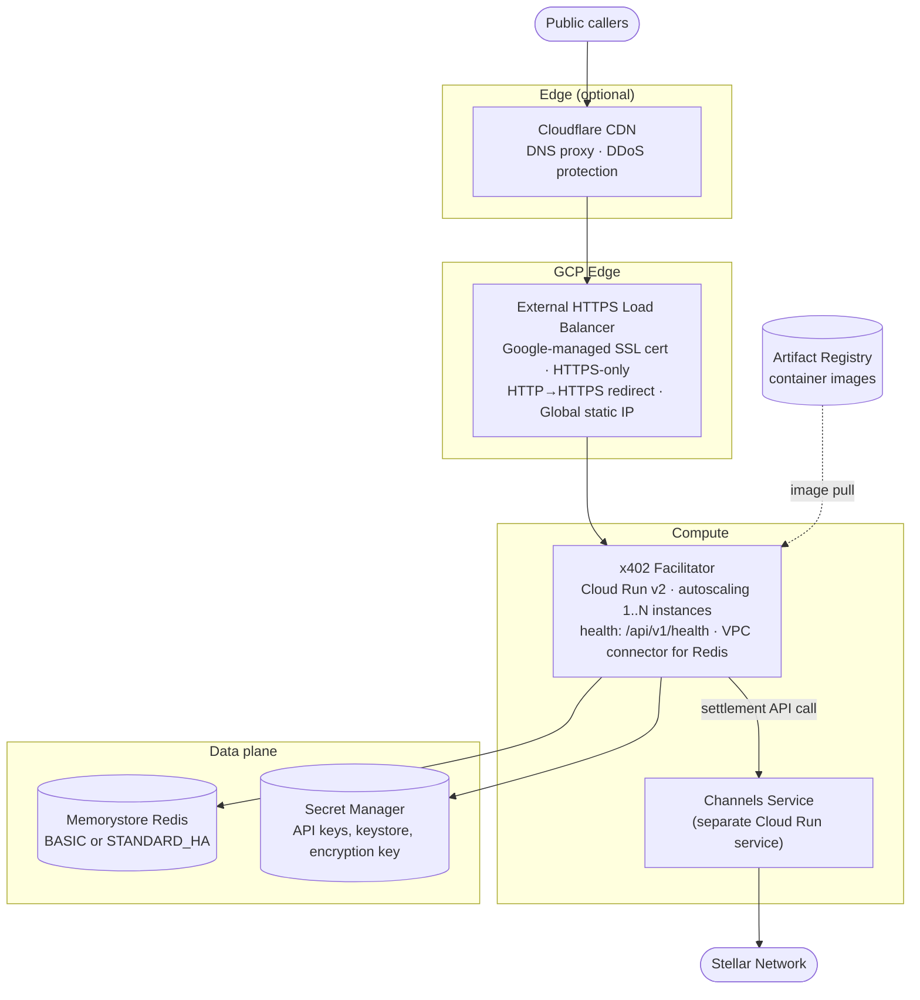
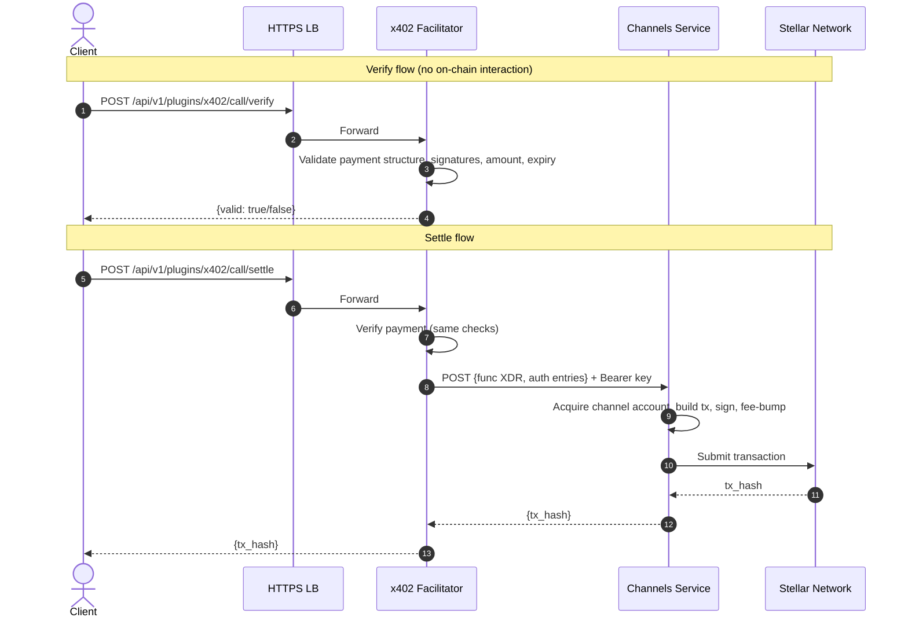

# x402 Payment Facilitator on GCP: Operator Deployment Guide

How to deploy the [x402](https://www.x402.org/) payment facilitator on GCP. The facilitator verifies and settles x402 payments on the Stellar network, delegating on-chain transaction submission to a running Channels service.

Follow the sections in order — later steps depend on outputs from earlier ones. For the AWS equivalent, see [README-AWS.md](./README-AWS.md).

---

## 1. Architecture

### 1.1. Cloud architecture



Why these choices:

| Decision | Rationale |
| --- | --- |
| Cloud Run v2 | Fully managed, scales to zero in non-prod, autoscales under load. No cluster to babysit. |
| Shared load balancer (optional) | x402 can share an HTTPS LB with Channels via URL map path rules, or run its own. |
| No Pub/Sub | Everything is synchronous (verify/settle/supported) — no async pipeline needed. |
| No Cloud KMS | x402 doesn't sign transactions. The keystore is only for identity and signature verification, so Secret Manager is enough. |
| Minimal Redis | BASIC tier, 1 GB. x402 stores far less state than Channels. |
| Settlement via Channels | All on-chain transaction submission goes through the Channels service API. |

### 1.2. Components at a glance

| Component | GCP Service | What it does |
| --- | --- | --- |
| Compute | Cloud Run v2 | Runs the facilitator container, autoscales |
| State | Memorystore Redis 7.2 | Plugin state and transaction records |
| Secrets | Secret Manager | Stores the API key, keystore, passphrase, encryption key, and Channels API key |
| Load balancer | External HTTPS LB + Google-managed cert | TLS termination, health-checked routing |
| Image registry | Artifact Registry | Hosts container images |
| Networking | VPC + Serverless VPC Access Connector + Private Service Access | Private path to Memorystore |
| Observability | Cloud Logging + Cloud Monitoring | Structured JSON logs, metrics, alerts |

### 1.3. How it works

The facilitator doesn't submit transactions to Stellar itself. It verifies payment payloads and hands off settlement to Channels:

1. `POST /verify` — validates payment structure, user-signed auth entries, amount, asset, and expiry. No on-chain interaction.
2. `POST /settle` — runs the same verification, extracts the Soroban host function XDR and user-signed auth entries, then calls the Channels API. Channels acquires a channel account, builds/signs the transaction, and submits it.
3. `GET /supported` — returns discovery info (supported networks, accepted assets, signer address) per the XC-Payments spec.

### 1.4. Request flow



### 1.5. Resource sizing

| Resource | Module default (prod) | Module default (non-prod) |
| --- | --- | --- |
| CPU | 1 vCPU | 1 vCPU |
| Memory | 2 Gi | 2 Gi |
| Min instances | 2 | 1 |
| Max instances | 10 | 4 |
| CPU always allocated | yes | no |
| Redis tier | BASIC | BASIC |
| Redis memory | 1 GB | 1 GB |
| LB deletion protection | on | off |
| Log retention | 30 days | 7 days |

x402 is much lighter than Channels. A 1 GB BASIC Redis and 1 vCPU Cloud Run instances handle production traffic comfortably — scale up only if you see sustained high CPU or memory.

---

## 2. Prerequisites

### 2.1. Accounts and access

| Requirement | Details |
| --- | --- |
| GCP project | Billing enabled, permissions to create Cloud Run, Memorystore, Secret Manager, Compute Engine LB, VPC connectors, Artifact Registry, IAM bindings |
| Terraform | >= 1.5.0 |
| Google provider | >= 5.0, < 7.0 |
| gcloud CLI | Recent stable, authenticated |
| Docker | For pulling and pushing container images to your registry |
| Running Channels service | x402 calls Channels for settlement — deploy Channels first (see the [GCP Channels module](../gcp/)). |
| Domain + DNS access | For the HTTPS load balancer SSL certificate |
| (Optional) Cloudflare | For CDN proxying and DNS management |

### 2.2. Stellar setup

Each environment needs its own Stellar keypair. The facilitator account serves two purposes: its address is returned in `/supported` for client discovery, and it's used to validate user-signed auth entries in `/verify`.

It's *not* used for building transactions, providing sequence numbers, or paying fees — Channels handles all of that.

**Generate a keystore:**

```bash
# From the openzeppelin-relayer repo
cargo run --example create_key -- \
  --password <YOUR_PASSPHRASE> \
  --output-dir ./keys \
  --filename local-signer.json
```

The keystore JSON file is ~500 bytes. Note the Stellar public address from the output.

**Fund the account:**

The account must exist on-chain with enough XLM for base reserves and trustlines. On testnet, use [friendbot](https://friendbot.stellar.org). On mainnet, transfer XLM from an existing funded account.

### 2.3. Channels API keys

You'll need Channels API keys so x402 can call the Channels service for settlement:

- Staging: 1 key (testnet)
- Production: 2 keys (one for mainnet, one for testnet)

Generate them via the Channels management endpoint. Heads up: the default fee limit on a new key is often too low for x402 settlement volume, so bump it right after generation.

---

## 3. Environments

Run staging and production as separate Terraform root modules (or workspaces) so their state is fully isolated:

| Env | Stellar network | Pub/Sub | Redis tier | Min instances |
| --- | --- | --- | --- | --- |
| `stg` | testnet | Not needed | BASIC | 1 |
| `prod-mainnet` | mainnet (pubnet) | Not needed | BASIC | 2 |
| `prod-testnet` | testnet | Not needed | BASIC | 2 |

Unlike Channels, x402 doesn't need Pub/Sub — all request processing is synchronous.

If environments share a VPC, use different VPC connector CIDRs (e.g. `10.8.0.0/28` for stg, `10.9.0.0/28` for prod).

---

## 4. Deployment

### 4.1. Authenticate

```bash
export GOOGLE_APPLICATION_CREDENTIALS="$HOME/path/to/service-account-key.json"
```

If your org blocks `gcloud auth application-default login`, create a service account key under IAM & Admin > Service Accounts > Keys.

### 4.2. Configure the Terraform backend

```hcl
terraform {
  backend "gcs" {
    bucket = "your-org-terraform-state"
    prefix = "x402/prod.tfstate"
  }
}
```

### 4.3. Generate secrets

Generate secret values and export them as Terraform variables. Don't commit these to version control.

```bash
export TF_VAR_relayer_api_key="$(uuidgen | tr '[:upper:]' '[:lower:]')"
export TF_VAR_keystore_json="$(cat keys/local-signer.json)"
export TF_VAR_keystore_passphrase="<your-passphrase>"
export TF_VAR_storage_encryption_key="$(openssl rand -base64 32)"
export TF_VAR_channels_api_key="<channels-api-key-from-channels-service>"
```

`storage_encryption_key` must be base64-encoded, not hex — see [Section 9.1](#91-storage_encryption_key-must-be-base64).

### 4.4. Call the module

In your root module (e.g. `environments/prod/main.tf`), call the x402 module:

```hcl
module "x402" {
  source = "git::https://github.com/OpenZeppelin/relayer-channels-infra.git//modules/x402/gcp?ref=main"

  # Core
  project_id  = "my-gcp-project"
  region      = "us-east1"
  environment = "prod"

  # Networking
  network    = "default"
  subnetwork = "default"

  # DNS
  domain_name = "x402.your-company.com"

  # Container
  container_image = "us-east1-docker.pkg.dev/my-project/x402/facilitator:latest"

  # Secrets (pass via TF_VAR_* environment variables)
  relayer_api_key        = var.relayer_api_key
  keystore_json          = var.keystore_json
  keystore_passphrase    = var.keystore_passphrase
  storage_encryption_key = var.storage_encryption_key
  channels_api_key       = var.channels_api_key

  # Optional overrides
  # cpu                = "2"
  # memory             = "4Gi"
  # min_instance_count = 3
  # max_instance_count = 20
  # redis_tier         = "STANDARD_HA"
  # log_level          = "info"
  # connector_ip_cidr_range = "10.9.0.0/28"

  # Cloudflare (optional)
  # enable_cloudflare  = true
  # cloudflare_zone_id = "abc123..."
}
```

You'll also need wrapper variables so Terraform picks up the `TF_VAR_*` exports:

```hcl
variable "relayer_api_key" {
  type      = string
  sensitive = true
}

variable "keystore_json" {
  type      = string
  sensitive = true
}

variable "keystore_passphrase" {
  type      = string
  sensitive = true
}

variable "storage_encryption_key" {
  type      = string
  sensitive = true
}

variable "channels_api_key" {
  type      = string
  sensitive = true
}
```

Wire up whichever outputs you need:

```hcl
output "load_balancer_ip" {
  value = module.x402.load_balancer_ip
}

output "cloud_run_service_name" {
  value = module.x402.cloud_run_service_name
}

output "domain_name" {
  value = module.x402.domain_name
}
```

The module handles everything: enabling GCP APIs, creating secrets, provisioning networking (VPC connector, Private Service Access), Memorystore Redis, the HTTPS LB with a Google-managed SSL cert, and the Cloud Run service with IAM bindings. You don't need to create any of these yourself.

**Module inputs reference** — see `variables.tf` for the full list. Notable optional inputs:

| Input | Default | Description |
| --- | --- | --- |
| `app_name` | `"x402-facilitator"` | Resource name prefix |
| `connector_ip_cidr_range` | `"10.8.0.0/28"` | VPC connector CIDR (must be /28, unique per env) |
| `cpu` | `"1"` | Cloud Run CPU allocation |
| `memory` | `"2Gi"` | Cloud Run memory allocation |
| `min_instance_count` | `null` (2 for prod, 1 otherwise) | Minimum Cloud Run instances |
| `max_instance_count` | `null` (10 for prod, 4 otherwise) | Maximum Cloud Run instances |
| `redis_tier` | `null` (BASIC) | `BASIC` or `STANDARD_HA` |
| `redis_memory_size_gb` | `null` (1) | Memorystore memory in GB |
| `log_level` | `"warn"` | Application log level |
| `lb_timeout_sec` | `60` | Backend service timeout (seconds) |
| `enable_cloudflare` | `false` | Enable Cloudflare DNS proxy |
| `dns_managed_zone_name` | `""` | Cloud DNS zone (leave empty to skip) |
| `container_environment` | `[]` | Additional env vars for the container |
| `labels` | `{}` | Labels applied to all resources |

**Module outputs:**

| Output | Description |
| --- | --- |
| `load_balancer_ip` | Global static IP address of the HTTPS load balancer |
| `cloud_run_service_name` | Cloud Run service name |
| `cloud_run_service_uri` | Cloud Run service URI (internal) |
| `cloud_run_service_account_email` | Cloud Run service account email |
| `domain_name` | Service domain name |
| `redis_host` | Memorystore Redis host IP |
| `redis_port` | Memorystore Redis port |
| `secret_ids` | Map of secret names to Secret Manager secret IDs (sensitive) |
| `cloudflare_dns_record_id` | Cloudflare DNS record ID (null if disabled) |

### 4.5. Container image

Pre-built x402 facilitator images are published to [OpenZeppelin's Docker Hub](https://hub.docker.com/u/openzeppelin). Pull the right tag and push it to your Artifact Registry (Cloud Run can't pull from Docker Hub directly).

Tags follow the pattern `mainnet-<version>`, `testnet-<version>`, `mainnet-latest`, `testnet-latest`.

```bash
# Pull from Docker Hub, re-tag for Artifact Registry, and push
docker pull openzeppelin/x402-facilitator:mainnet-latest

gcloud auth configure-docker <region>-docker.pkg.dev
docker tag openzeppelin/x402-facilitator:mainnet-latest \
  <region>-docker.pkg.dev/<project-id>/<repo>/x402-facilitator:mainnet-latest
docker push \
  <region>-docker.pkg.dev/<project-id>/<repo>/x402-facilitator:mainnet-latest
```

### 4.6. Deploy

```bash
terraform init
terraform plan -out plan.tfplan
terraform apply plan.tfplan
```

This takes 10-15 minutes. Memorystore is the slowest piece.

After apply, grab these outputs:

| Output | Used for |
| --- | --- |
| `load_balancer_ip` | DNS record creation |
| `cloud_run_service_name` | Service management, rolling updates |
| `cloud_run_service_uri` | Direct Cloud Run URL (bypasses LB) |
| `redis_host` | Debugging connectivity issues |

### 4.7. DNS and SSL

The Google-managed cert won't provision until DNS points at the LB IP.

**Without Cloudflare:**

1. Create an A record: `x402.your-company.com` -> `<load_balancer_ip>`
2. Wait 15-60 min for cert to go ACTIVE

Check cert status:

```bash
gcloud compute ssl-certificates describe x402-facilitator-cert \
  --format="value(managed.status)"
```

**With Cloudflare:**

1. Create Cloudflare A record -> LB IP (proxy OFF, grey cloud initially)
2. Wait for cert to go ACTIVE
3. Turn Cloudflare proxy ON (orange cloud)

If you set `enable_cloudflare = true` and provided `cloudflare_zone_id` in the module call, the DNS record is created automatically.

If the cert stays `FAILED_NOT_VISIBLE` for 30+ min, bump the cert name suffix (e.g. `-cert` -> `-cert-v2`) and re-apply. `create_before_destroy` swaps it without downtime.

### 4.8. Verify

```bash
# Check Cloud Run service status
gcloud run services describe x402-facilitator-service \
  --region <region> \
  --format "value(status.conditions[0].status)"

# Test the health endpoint
curl -sS https://x402.your-company.com/api/v1/health
# Expected: {"status":"ok"} or 401 depending on auth configuration

# Test the supported endpoint
curl -H "Authorization: Bearer <your-api-key>" \
  https://x402.your-company.com/api/v1/plugins/x402/call/supported
```

---

## 5. Configuration Reference

### 5.1. Environment variables

| Variable | Prod | Stg | Description |
| --- | --- | --- | --- |
| `REDIS_URL` | `redis://<host>:6379` | same | Memorystore Redis endpoint |
| `REPOSITORY_STORAGE_TYPE` | `redis` | `redis` | Storage backend |
| `RESET_STORAGE_ON_START` | `false` | `false` | Preserve state across restarts |
| `CONFIG_FILE_PATH` | `config/config.json` | same | Plugin and relayer config path |
| `HOST` | `0.0.0.0` | same | Bind address |
| `LOG_LEVEL` | `warn` | `info` | Application log level |
| `LOG_FORMAT` | `json` | `json` | Structured logging format |
| `METRICS_ENABLED` | `true` | `true` | Expose Prometheus metrics |
| `METRICS_PORT` | `8081` | `8081` | Metrics endpoint port |

### 5.2. Rate limiting and concurrency

| Variable | Prod | Stg | Description |
| --- | --- | --- | --- |
| `RATE_LIMIT_REQUESTS_PER_SECOND` | `200` | `400` | Global request rate limit |
| `RATE_LIMIT_BURST` | `200` | `500` | Burst allowance above steady rate |
| `MAX_CONNECTIONS` | `1000` | `4000` | Max concurrent HTTP connections |
| `RELAYER_CONCURRENCY_LIMIT` | `400` | `800` | Max concurrent relayer operations |
| `PLUGIN_MAX_CONCURRENCY` | `1000` | `4000` | Max concurrent plugin invocations |
| `TRANSACTION_EXPIRATION_HOURS` | `0.1` | `0.1` | Transaction TTL (~6 minutes) |
| `REQUEST_TIMEOUT_SECONDS` | `60` | `60` | HTTP request timeout |
| `PLUGIN_POOL_REQUEST_TIMEOUT_SECS` | `60` | `60` | Plugin pool request timeout |

### 5.3. Secrets (Secret Manager)

| Env var | Secret ID | Description |
| --- | --- | --- |
| `API_KEY` | `{app_name}-api-key` | Relayer management API key |
| `KEYSTORE_JSON` | `{app_name}-keystore-json` | Stellar keystore file contents |
| `KEYSTORE_PASSPHRASE` | `{app_name}-keystore-passphrase` | Keystore passphrase |
| `STORAGE_ENCRYPTION_KEY` | `{app_name}-storage-encryption-key` | 32-byte base64 key for Redis encryption |
| `CHANNELS_API_KEY` | `{app_name}-channels-api-key` | Channels service API key for settlement |

---

## 6. Operational Playbook

### 6.1. Rolling deployment

Pull the new version from Docker Hub, push it to your Artifact Registry, then update Cloud Run:

```bash
# Pull new version and push to your registry
docker pull openzeppelin/x402-facilitator:mainnet-<version>
docker tag openzeppelin/x402-facilitator:mainnet-<version> \
  <region>-docker.pkg.dev/<project>/<repo>/x402-facilitator:<version>
docker push <region>-docker.pkg.dev/<project>/<repo>/x402-facilitator:<version>

# Update Cloud Run
gcloud run services update x402-facilitator-service \
  --region <region> \
  --image <region>-docker.pkg.dev/<project>/<repo>/x402-facilitator:<version>
```

Cloud Run rolls this out automatically — new instances have to pass health checks before old ones get drained.

### 6.2. Scaling

Cloud Run autoscales on concurrency and CPU. To override:

```bash
# Change min/max instances
gcloud run services update x402-facilitator-service \
  --region <region> \
  --min-instances 3 \
  --max-instances 20
```

### 6.3. Viewing logs

```bash
# Stream live logs
gcloud logging read \
  "resource.type=cloud_run_revision AND resource.labels.service_name=x402-facilitator-service" \
  --project <project-id> \
  --format json \
  --limit 50

# Search for errors
gcloud logging read \
  "resource.type=cloud_run_revision AND resource.labels.service_name=x402-facilitator-service AND severity>=ERROR" \
  --project <project-id> \
  --format json
```

Or use the Cloud Console: **Cloud Run > x402-facilitator-service > Logs**.

### 6.4. Redis inspection

Redis is only reachable from inside the VPC. You'll need a bastion or Cloud Run exec:

```bash
# From a Compute Engine instance in the same VPC
redis-cli -h <redis-host> -p 6379

# Useful commands
redis-cli -h <redis-host> INFO memory
redis-cli -h <redis-host> DBSIZE
```

### 6.5. Rotating secrets

1. Generate new secret values.
2. Add a new secret version:
   ```bash
   echo -n "<new-value>" | gcloud secrets versions add x402-facilitator-api-key \
     --data-file=-
   ```
3. Redeploy Cloud Run to pick up the new secret:
   ```bash
   gcloud run services update x402-facilitator-service \
     --region <region> \
     --update-env-vars "API_KEY=<new-value>"
   ```

### 6.6. Checking Memorystore status

```bash
gcloud redis instances describe x402-facilitator-redis \
  --region <region> \
  --format "table(name, state, host, port, tier, memorySizeGb)"
```

---

## 7. Security Model

### 7.1. Network isolation

| Layer | Rule |
| --- | --- |
| Cloud Run ingress | `INGRESS_TRAFFIC_INTERNAL_LOAD_BALANCER` (prod). Only reachable via the HTTPS LB. |
| Memorystore | `PRIVATE_SERVICE_ACCESS` only. No public IP. Only reachable from VPC-connected resources. |
| VPC connector | `PRIVATE_RANGES_ONLY` egress. Cloud Run routes only private IP traffic through the connector. |
| HTTPS LB | Google-managed cert, HTTPS-only, HTTP->HTTPS redirect. |

### 7.2. Secrets management

All secrets live in Secret Manager with automatic replication. The Cloud Run service account gets `roles/secretmanager.secretAccessor` scoped to the specific secrets it needs — nothing broader. Secrets are injected as env vars at container start. None end up in the container image or Terraform state (pass them via `TF_VAR_*`).

### 7.3. IAM least privilege

| Role | Granted to | Purpose |
| --- | --- | --- |
| `roles/secretmanager.secretAccessor` | Cloud Run SA | Access specific secrets |
| `roles/monitoring.metricWriter` | Cloud Run SA | Write custom metrics |
| `roles/logging.logWriter` | Cloud Run SA | Write application logs |
| `roles/run.invoker` | allUsers | Allow LB to invoke Cloud Run (ingress is restricted to LB) |

---

## 8. Monitoring and Alerting

### 8.1. Cloud Monitoring metrics

Metrics worth watching:

| Metric | Source | Alert threshold |
| --- | --- | --- |
| `run.googleapis.com/container/cpu/utilization` | Cloud Run | > 70% sustained |
| `run.googleapis.com/container/memory/utilization` | Cloud Run | > 80% sustained |
| `run.googleapis.com/container/instance_count` | Cloud Run | < min expected |
| `run.googleapis.com/request_count` | Cloud Run | Monitor for spikes |
| `run.googleapis.com/request_latency` | Cloud Run | p99 > 10s |

### 8.2. Creating alerts

Via Cloud Console or Terraform:

```bash
# Example: alert on high CPU
gcloud monitoring policies create \
  --display-name "x402 high CPU" \
  --condition-display-name "CPU > 70%" \
  --condition-filter 'resource.type="cloud_run_revision" AND resource.labels.service_name="x402-facilitator-service" AND metric.type="run.googleapis.com/container/cpu/utilizations"' \
  --condition-threshold-value 0.7 \
  --condition-threshold-comparison COMPARISON_GT \
  --condition-threshold-duration 120s \
  --notification-channels <channel-id>
```

### 8.3. Log-based metrics

You can create log-based metrics for app-level monitoring:

```bash
# Error rate
gcloud logging metrics create x402_errors \
  --description "x402 application errors" \
  --log-filter 'resource.type="cloud_run_revision" AND resource.labels.service_name="x402-facilitator-service" AND severity>=ERROR'
```

---

## 9. Key Gotchas

### 9.1. STORAGE_ENCRYPTION_KEY must be base64

`STORAGE_ENCRYPTION_KEY` must be a 32-byte base64-encoded string, **not hex**. Generate it with:

```bash
openssl rand -base64 32
```

If you accidentally use hex encoding, the relayer won't start and the error message isn't helpful.

### 9.2. VPC connector CIDR overlap

Each environment needs its own `/28` CIDR for the VPC connector. If stg and prod share a VPC, use different ranges:
- stg: `10.8.0.0/28`
- prod: `10.9.0.0/28`

### 9.3. Private Service Access is shared

GCP allows only one Private Service Access connection per VPC per service (`servicenetworking.googleapis.com`). If Channels already created one, you can either import it into your x402 Terraform state (`terraform import google_service_networking_connection.private_service <vpc-name>`) or just share the VPC peering range — both modules can use the same connection.

### 9.4. SSL cert provisioning delay

Google-managed SSL certs take 15-60 minutes to provision after DNS points at the LB IP. HTTPS will fail during this window. If the cert stays `FAILED_NOT_VISIBLE` for 30+ minutes, verify DNS is correct, then bump the cert resource name suffix (e.g. `-cert` -> `-cert-v2`) and re-apply.

### 9.5. Channels API key fee limits

New Channels API keys ship with a low default fee limit that probably won't cut it for x402 settlement volume. Bump it via the Channels management endpoint before deploying x402.

### 9.6. Transaction expiration is 6 minutes

`TRANSACTION_EXPIRATION_HOURS=0.1` means transactions expire after ~6 minutes. If Channels is slow to settle, x402 will treat the transaction as expired. Make sure Channels is healthy and responsive before you start taking traffic.

### 9.7. Memorystore maintenance window

BASIC tier Redis has no failover. You might see brief unavailability during the weekly maintenance window (Saturday 00:00-01:00 UTC by default). The relayer reconnects automatically, but if you need zero-downtime, upgrade to `STANDARD_HA`.

### 9.8. Cloud Run cold starts

With `cpu_idle = true` (the non-prod default), Cloud Run can scale to zero and you'll hit cold-start latency (~5-10s). For production, set `cpu_idle = false` and `min_instance_count >= 2` to keep instances warm.

---

## 10. Appendix

### 10.1. Resource summary per environment

| Resource | Staging | Production |
| --- | --- | --- |
| Cloud Run instances | 1-4 | 2-10 |
| CPU / Memory | 1 vCPU / 2 Gi | 2 vCPU / 4 Gi |
| CPU always allocated | No | Yes |
| Redis tier | BASIC | BASIC |
| Redis memory | 1 GB | 1 GB |
| Log retention | 7 days | 30 days |
| LB deletion protection | Off | On |
| Cloud Run ingress | All traffic | Internal + LB only |

### 10.2. Terraform provider versions

| Provider | Version |
| --- | --- |
| Terraform | >= 1.5.0 |
| Google | >= 5.0, < 7.0 |
| Cloudflare (optional) | ~> 5.0 |

### 10.3. Container image layout

```
/app/
├── config/
│   ├── config.json            # Plugin config, network entries, Channels service URLs
│   └── keys/
│       └── local-signer.json  # Written by entrypoint from KEYSTORE_JSON env var
├── plugins/
│   └── x402/                  # x402-facilitator plugin + dependencies
├── entrypoint.sh              # Writes keystore, injects API keys, starts app
└── openzeppelin-relayer       # Rust binary
```

### 10.4. GCP APIs required

```
run.googleapis.com
secretmanager.googleapis.com
redis.googleapis.com
vpcaccess.googleapis.com
compute.googleapis.com
monitoring.googleapis.com
logging.googleapis.com
certificatemanager.googleapis.com
servicenetworking.googleapis.com
artifactregistry.googleapis.com
```

### 10.5. Comparison: x402 vs Channels on GCP

| Aspect | Channels | x402 |
| --- | --- | --- |
| What it does | Pays fees and submits transactions via channel accounts | Verifies payments, delegates settlement to Channels |
| Compute | Cloud Run (2-20 instances, 4 vCPU, 8 Gi) | Cloud Run (1-10 instances, 1-2 vCPU, 2-4 Gi) |
| Redis | STANDARD_HA, 5 GB | BASIC, 1 GB |
| Pub/Sub | 8 topics + subscriptions | None |
| Cloud KMS | ED25519 keyring for tx signing | None (identity-only keystore in Secret Manager) |
| Request model | Async (202 Accepted, poll for status) | Synchronous (request/response) |
| On-chain tx | Direct via channel account pool | Delegates to Channels |
| Sequence numbers | KV-cached pool with mutual exclusion | N/A — Channels owns this |
| Cloud Functions | Optional (balance check) | None |
